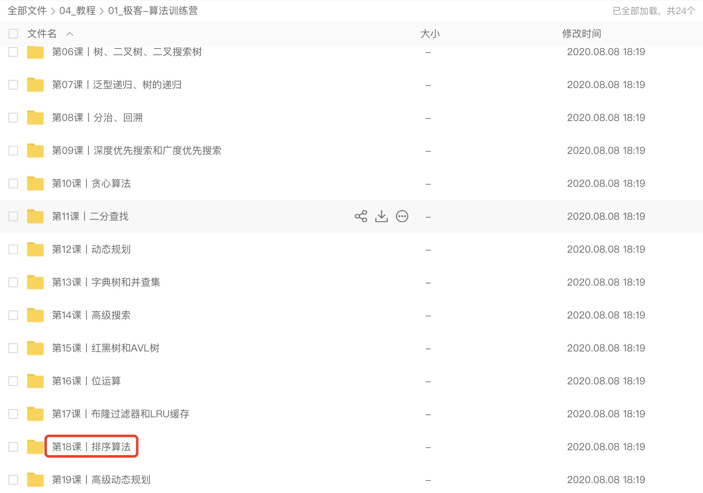

# 10大排序面试突击思路和3个NLogN算法Go语言实现

## 突击思路

中高级以上岗位面试时，基本不会问指数级别时间复杂度的算法，问的最多的就是NLogN的算法：`快排、归并和堆排序`。堆排序因为基于完全二叉树，个人感觉相对其他2个复杂一些，所以推荐`重心放在在快排和归并`上，特别说明的一点是：`快排务必能手撕代码`。

## 算法复杂度

从最佳一列，我们看到只有3个算法是NlogN级别，也是面试时问的最多的：


## 推荐学习资源

1. 动画演示：[十大经典排序算法（动图演示）](https://www.cnblogs.com/onepixel/p/7674659.html?version=3.7.5&from=mac_yunguanjia&privilege=%20Sorting%20Algorithms%20Animations)
这个文章很经典，看动图会比较直观，但是说实话，三大高级排序算法看的我还是云里雾里，看不懂。
2. B站视频
    - 快排（[B站视频](https://www.bilibili.com/video/BV1at411T75o?from=search&seid=17709611481602989795)）：在B站搜索快排，结果中另外一个Up主（[正月点灯笼](https://space.bilibili.com/24014925?spm_id_from=333.788.b_765f7570696e666f.2)）也讲的很好，但是我是看的这个掌握的，讲的很细，但是没有代码实现。

    - 归并排序（[B站视频](https://www.bilibili.com/video/BV1et411N7Ac?from=search&seid=12938757773760664991)）：同一个UP主，也讲的比较细，但是没有代码实现。

    - 堆排序（[B站视频](https://www.bilibili.com/video/BV1Eb41147dK?from=search&seid=17080947590546271090)）：换了一个Up主（[正月点灯笼](https://space.bilibili.com/24014925?spm_id_from=333.788.b_765f7570696e666f.2)），我觉得这个排序他讲的很细，用vim敲C++代码也非常的溜，可以看一下他的 [VIM入门教程](https://www.bilibili.com/video/BV1Yt411X7mu)（[这个博友总结出来了](https://blog.csdn.net/qq_45239614/article/details/105163766)） ，对于新手还是帮助比较大。

3. 极客时间算法训练营-谭超（网上找一下，网盘里面能搜到的）


通过结合这几个资源，把3个高级排序掌握，基本上算法的排序部分就再也不怕被问到了。

## 初级排序 - O(n^2)

`初级排序一般不用，了解工作原理即可，问的概率低，撕代码没有性价比，可以不掌握`，可以访问：动画演示：[十大经典排序算法（动图演示）](https://www.cnblogs.com/onepixel/p/7674659.html?version=3.7.5&from=mac_yunguanjia&privilege=%20Sorting%20Algorithms%20Animations) 进一步加深理解。

### 选择排序（Selection Sort）
`每次找最小值，然后放到待排序数组的起始位置`。

补充：首先在未排序序列中找到最小（大）元素，存放到排序序列的起始位置，然后，再从剩余未排序元素中继续寻找最小（大）元素，然后放到已排序序列的末尾。以此类推，直到所有元素均排序完毕。

### 插入排序（Insertion Sort）
`从前到后逐步构建有序序列`；对于未排序数据，在已排序序列中从后向前扫描，找到相应位置并插入。

### 冒泡排序（Bubble Sort）
嵌套循环，每次查看相邻的元素如果逆序，则交换。

## 高级排序 - O(N*logN)

重要程度依次为：快排 >  归并 > 堆排序，快排务必能手写代码。

### 快速排序(Quick Sort) - 分治
PS：`必须掌握，能手撕代码`

一句话解释：`数组取标杆pivot，将小元素放pivot左边，大元素放pivot右边，然后依次对右边和左边的字数组继续快排，以达到整个序里有序`。

算法描述（[B站视频](https://www.bilibili.com/video/BV1at411T75o?from=search&seid=17709611481602989795)）：
1. 选定pivot中心轴
2. 将大于pivot的放右边
3. 将小于pivot的放左边
4. 分别对左右子序里重复前3步操作


代码实现：
```go
func quickSort(arr []int, begin int, end int) {
    if begin >= end {
        return
    }
    // 分区
    pivot := partition(arr, begin, end)
    // 对左边递归快排
    quickSort(arr, begin, pivot-1)
    // 对右边递归快排
    quickSort(arr, pivot+1, end)
}

func partition(arr []int, begin int, end int) int {
    // 选取最后一个元素的好处：
    pivot := end
    count := begin
    // 把所有小于pivot的元素都放到左侧
    for i := begin; i < end; i++ {
        if arr[i] < arr[pivot] {
            // 这里可以做一个：arr[i] != arr[count] 比较，避免无谓的替换，为了保持简洁，模板代码里面不体现
            swap(&arr[i], &arr[count])
            count++
        }
    }
    swap(&arr[pivot], &arr[count])
    return count
}

func swap(a *int, b *int) {
    temp := *a
    *a = *b
    *b = temp
}
```

测试代码：
```go
func main() {
	slice := []int{5, 8, 1, 45, 32, 6, 31, 58, 2}
	quickSort(slice, 0, len(slice)-1)
	for _, v := range slice {
		fmt.Println(v)
	}
}
```

为什么pivot要选取最后一个元素？快速排序-常见中轴(主元pivot)选择方法及实现代码（末位/随机/三数中值/..）

### 归并排序(Merge Sort) - 分治
`平时用的也很多，可以认为是“快排的逆向”`。

算法描述（[B站视频](https://www.bilibili.com/video/BV1et411N7Ac?from=search&seid=12938757773760664991)）：
1. 把长度为n的输入序列分成两个长度为n/2的子序列；
2. 对这两个子序列分别采用归并排序；
3. 将两个排序好的子序列合并成一个最终的排序序列。


代码实现：
```go
func mergeSort(arr []int, begin, end int) {
    if begin >= end {
        return
    }
    mid := (begin + end) / 2
    mergeSort(arr, begin, mid)
    mergeSort(arr, mid+1, end)
    merge(arr, begin, mid, end)
}

// begin - mid：有序
// mid - end: 有序
// 合并2个有序的数组
// 这里有一个很不好理解的地方：上面没看到有排序代码，为什么说是有序的？
// 这个视频：https://www.bilibili.com/video/BV1et411N7Ac?from=search&seid=12938757773760664991
// 里有补充说明，最小的组每个都是1个元素，所以自然也就是有序的
func merge(arr []int, begin int, mid int, end int) {
    temp := make([]int, end-begin+1)
    // 一开始指向2个头部
    i := begin
    j := mid + 1
    // 已经合并的个数
    k := 0

    // 3段式while
    // while: 比较2个数组的头部，小的取出来
    for ; i <= mid && j <= end; k++ {
        if arr[i] <= arr[j] {
            temp[k] = arr[i]
            i++
        } else {
            temp[k] = arr[j]
            j++
        }
    }

    // while: 有可能左边的有剩下，全部移进去
    for ; i <= mid; i++ {
        temp[k] = arr[i]
        k++
    }

    // while：也有可能右边的有剩下，全部移进去，和上面的情况是互斥的
    for ; j <= end; j++ {
        temp[k] = arr[j]
        k++
    }

    copy(arr[begin:end+1], temp)
}
```

测试代码：
```go
func main() {
	slice := []int{1, 55, 23, 12, 7, 4, 64, 34, 7, 323}
	mergeSort(slice, 0, len(slice)-1)
	for _, v := range slice {
		fmt.Println(v)
	}
}
```


快排和归并比较：
* `归并和快排具有相似性，但步骤顺序相反`
* 归并：先排序左右子数组，然后合并两个有序子数组
* 快排：先调配出左右子数组，然后对于左右子数组进行排序

### 堆排序（Heap Sort）- 堆插入O(logN)，取最大/最小值O(1)
算法描述（[B站视频](https://www.bilibili.com/video/BV1Eb41147dK?from=search&seid=17080947590546271090)）：
1. 数组元素依次建立小顶堆（和大顶堆的区别）
2. 依次取堆顶元素，并删除


PS1：堆排序的前提是，Complete Binary Tree + Parent > Children
PS2：因为是完全二叉树，所以可以用一维数组来表示，所以为什么代码里面没有tree而是使用的数组。


```go
func swap(tree []int, i, j int) {
    temp := tree[i]
    tree[i] = tree[j]
    tree[j] = temp
}

func heapify(tree []int, length, i int) {
    if i >= length {
        return
    }

    // 完全二叉树，可以用一维数组表示，此时可以计算各个节点的位置
    c1 := 2*i + 1
    c2 := 2*i + 2
    max := i

    // 2个子节点比父节点大，记录，注意C1和C2可能越界
    if c1 < length && tree[c1] > tree[max] {
        max = c1
    }

    if c2 < length && tree[c2] > tree[max] {
        max = c2
    }

    if max != i {
        swap(tree, max, i)
        // 继续往上找
        heapify(tree, length, max)
    }
}

func buildHeap(tree []int, length int) {
    lastNode := length - 1
    parent := (lastNode - 1) / 2
    for i := parent; i >= 0; i-- {
        heapify(tree, length, i)
    }    
}

func heapSort(arr []int, length int) {
    buildHeap(arr, length)
    for i := length - 1; i >= 0; i-- {
        swap(arr, i, 0)
        heapify(arr, i, 0)
    }
}
```

测试代码：
```go
// 测试heapify，把4和10交换
// 这颗树如下：
//   4
// 10 3
// 5 1 2
func testHeapify() {
    treeSlice := []int{4, 10, 3, 5, 1, 2}
    length := len(treeSlice)
    heapify(treeSlice, length, 0)

    for _, v := range treeSlice {
        fmt.Println(v)
    }
}

func main() {
	//testHeapify()
	slice := []int{4, 10, 3, 5, 1, 2}
	length := len(slice)
	heapSort(slice, length)

	for _, v := range slice {
		fmt.Println(v)
	}
}
```


## 结语

`Good Luck！`

## 参考

- [时空复杂度（时间复杂度/空间复杂度）O(1)、O(n)、O(n^2)、O(log n)、O(n log n)是什么意思](https://blog.csdn.net/lkp1603645756/article/details/85013126)
- [TimSort算法分析](https://www.cnblogs.com/brucecloud/p/6085703.html)
- [十大经典排序算法（动图演示](https://www.cnblogs.com/onepixel/p/7674659.html?version=3.7.5&from=mac_yunguanjia&privilege=%20Sorting%20Algorithms%20Animations)