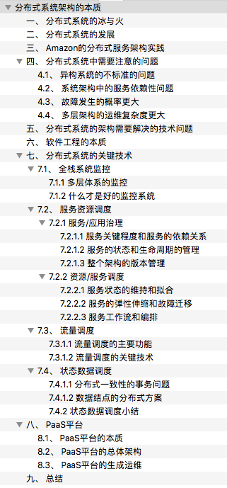
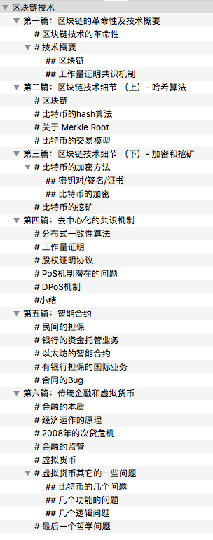

# Linux C++后端开发学习路线参考汇总

## 如何快速掌握C++？

网络上有个段子：[21天教你学会C++](https://coolshell.cn/articles/2250.html)


## 路线一（<6个月）：知乎Milo Yip

> 转载自：https://www.zhihu.com/question/23933514

C++缺点之一，是相对许多语言复杂，而且难学难精。许多人说学习C语言只需一本K&R[《C程序设计语言》](https://link.zhihu.com/?target=http%3A//book.douban.com/subject/1139336/)即可，但C++书籍却是多不胜数。我是从C进入C++，皆是靠阅读自学。在此分享一点学习心得。个人认为，学习C++可分为4个层次：
- `第一层次，C++基础`：挑选一本入门书籍，如[《C++ Primer》](https://link.zhihu.com/?target=http%3A//book.douban.com/subject/4262575/)、[《C++大学教程》](https://link.zhihu.com/?target=http%3A//book.douban.com/subject/2030264/)、或Stroustrup撰写的经典[《C++程序设计语言》](https://link.zhihu.com/?target=http%3A//book.douban.com/subject/1099889/)或他一年半前的新作[《C++程序设计原理与实践》](https://link.zhihu.com/?target=http%3A//book.douban.com/subject/4875599/)，而一般C++课程也止于此，另外[《C++ 标准程序库》](https://link.zhihu.com/?target=http%3A//book.douban.com/subject/1110941/)及[《The C++ Standard Library Extensions》](https://link.zhihu.com/?target=http%3A//book.douban.com/subject/1868179/)可供参考；
- `第二层次，正确高效地使用C++`：此层次开始必须自修，阅读过[《Effective C++》](https://link.zhihu.com/?target=http%3A//book.douban.com/subject/1842426/)、[《More Effective C++》](https://link.zhihu.com/?target=http%3A//book.douban.com/subject/1241385/)、[《Exceptional C++》](https://link.zhihu.com/?target=http%3A//book.douban.com/subject/1967356/)、[《More Exceptional C++》](https://link.zhihu.com/?target=http%3A//book.douban.com/subject/1244943/)、[《Effective STL》](https://link.zhihu.com/?target=http%3A//book.douban.com/subject/1792179/)、[《C++编程规范》](https://link.zhihu.com/?target=http%3A//book.douban.com/subject/1480481/)等，才适宜踏入专业C++开发之路；
- `第三层次，深入了解C++`：关于全局问题可读[《深入探索C++对象模型》](https://link.zhihu.com/?target=http%3A//book.douban.com/subject/1091086/)、[《Imperfect C++》](https://link.zhihu.com/?target=http%3A//book.douban.com/subject/1470838/)、[《C++沉思录》](https://link.zhihu.com/?target=http%3A//book.douban.com/subject/2970056/)、[《STL源码剖析》](https://link.zhihu.com/?target=http%3A//book.douban.com/subject/1110934/)，要挑战智商，可看关于模版及模版元编程的书籍如[《C++ Templates》](https://link.zhihu.com/?target=http%3A//book.douban.com/subject/2378124/)、[《C++设计新思维》](https://link.zhihu.com/?target=http%3A//book.douban.com/subject/1119904/)、[《C++模版元编程》](https://link.zhihu.com/?target=http%3A//book.douban.com/subject/4136223/)；
- `第四层次，研究C++`：阅读[《C++语言的设计和演化》](https://link.zhihu.com/?target=http%3A//book.douban.com/subject/1096216/)、[《编程的本质》](https://link.zhihu.com/?target=http%3A//book.douban.com/subject/4722718/)(含STL设计背后的数学根基)、C++标准文件[《ISO/IEC 14882:2003》](https://link.zhihu.com/?target=http%3A//openassist.googlecode.com/files/C%252B%252B%2520Standard%2520-%2520ANSI%2520ISO%2520IEC%252014882%25202003.pdf)、[C++标准委员会](https://link.zhihu.com/?target=http%3A//www.open-std.org/JTC1/SC22/WG21/)的提案书和报告书、关于C++的学术文献。

由于我主要是应用C++，大约只停留于第二、三个层次。然而，`C++只是软件开发的一环而已`，单凭语言并不能应付业务和工程上的问题。建议读者不要强求几年内“彻底学会C++的知识”，`到达第二层左右便从工作实战中汲取经验`，有兴趣才慢慢继续学习更高层次的知识。虽然学习C++有难度，但也是相当有趣且有满足感的。


## 路线二（<1年）：华中大守门员

> 原文：用一年时间如何能掌握 C++（实习总结及C++后端开发学习路线总结） https://www.nowcoder.com/discuss/637559

实习面试基本情况：
 先说一下楼主面试的情况，参与面试的公司：[CVTE](https://www.nowcoder.com/discuss/tag/666)、[搜狐](https://www.nowcoder.com/discuss/tag/148)、[东方财富](https://www.nowcoder.com/discuss/tag/1056)、[美团](https://www.nowcoder.com/discuss/tag/179)、[腾讯](https://www.nowcoder.com/discuss/tag/138)、[字节跳动](https://www.nowcoder.com/discuss/tag/665)、[阿里巴巴](https://www.nowcoder.com/discuss/tag/134)
 [CVTE](https://www.nowcoder.com/discuss/tag/666)：笔试-技术面1-技术面2-hr面-offer（第一次面试，蛮顺利的）
 [阿里巴巴提前批](https://www.nowcoder.com/discuss/tag/134)：技术面1-挂（当时没复习，问啥啥不会，其实阿里面的真不难）
 [东方财富](https://www.nowcoder.com/discuss/tag/1056)：技术面1-HR面-挂（HR面把我挂了，看不懂）
 [美团](https://www.nowcoder.com/discuss/tag/179)：技术面1-挂（觉得体验最差的一次面试，看我[面经]()就知道）
 [字节跳动](https://www.nowcoder.com/discuss/tag/665)：技术面1-技术面2-技术面3-hr面-offer（字节3面面试官拖了我快两星期才面，当时心态很差，同学都拿了大厂offer）
 [百度](https://www.nowcoder.com/discuss/tag/139)：技术面1-技术面2-技术面3（一个下午面完的，但是4.2上午出去接了水，[百度]()打过来的2个电话没接到，然后就没了）
 [腾讯](https://www.nowcoder.com/discuss/tag/138)：技术面1-技术面2-技术面3-hr面（刚面完，不知道发不发offer）
 后面其他公司笔试面试邀请都拒了。

 学习路线及推荐学习时间：

###  一、C++基础（3个月）

 1、面向对象的三大特性：封装、继承、多态
 2、类的访问权限：private、protected、public
 3、类的构造函数、析构函数、赋值函数、拷贝函数
 4、移动构造函数与拷贝构造函数对比
 5、深拷贝与浅拷贝的区别
 6、空类有哪些函数？空类的大小？
 7、内存分区：全局区、堆区、栈区、常量区、代码区
 8、C++与C的区别
 9、struct与class的区别
 10、struct内存对齐
 11、new/delete与malloc/free的区别
 12、内存泄露的情况
 13、sizeof与strlen对比
 14、指针与引用的区别
 15、野指针产生与避免
 16、多态：动态多态、静态多态
 17、虚函数实现动态多态的原理、虚函数与纯虚函数的区别
 18、继承时，父类的析构函数是否为虚函数？构造函数能不能为虚函数？为什么？
 19、静态多态：重写、重载、模板
 20、static关键字：修饰局部变量、全局变量、类中成员变量、类中成员函数
 21、const关键字：修饰变量、指针、类对象、类中成员函数
 22、extern关键字：修饰全局变量
 23、volatile关键字：避免编译器指令优化
 24、四种类型转换：static_cast、dynamic_cast、const_cast、reinterpret_cast
 25、右值引用
 26、std::move函数
 27、四种智能指针及底层实现：auto_ptr、unique_ptr、shared_ptr、weak_ptr
 28、shared_ptr中的循环引用怎么解决？（weak_ptr）
 29、vector与list比较
 30、vector迭代器失效的情况
 31、map与unordered_map对比
 32、set与unordered_set对比
 33、STL容器空间配置器

 参考书籍：《C++ Primer》（第5版）、《STL[源码]()剖析》、《深度探索C++对象模型》

### 二、计算机网络（1个月）

 1、OSI7层网络模型：应用层、表示层、会话层、运输层、网络层、链路层、物理层
 2、TCP/IP四层网络模型：应用层、运输层、网际层、接口层
 综合OSI与TCP/IP模型，学习五层网络模型：
 从上向下架构：应用层、运输层、网络层、链路层、物理层
 链路层：
 3、MTU
 4、MAC地址
 网络层：
 5、地址解析协议
 6、为啥有IP地址还需要MAC地址？同理，为啥有了MAC地址还需要IP地址？
 7、网络层转发数据报的流程
 8、子网划分、子网掩码
 9、网络控制报文协议ICMP
 10、ICMP应用举例：PING、traceroute
 运输层：
 11、TCP与UDP的区别及应用场景
 12、TCP首部报文格式（SYN、ACK、FIN、RST必须知道）
 13、TCP滑动窗口原理
 14、TCP超时重传时间选择
 15、TCP流程控制
 16、TCP拥塞控制（一定要弄清楚与流量控制的区别）
 17、TCP三次握手及状态变化。为啥不是两次握手？
 18、TCP四次挥手及状态变化。为啥不是三次挥手？
 19、TCP连接释放中TIME_WAIT状态的作用
 20、SYN泛洪攻击。如何解决？
 21、TCP粘包
 22、TCP心跳包
 23、路由器与交换机的区别
 24、UDP如何实现可靠传输
 应用层：
 25、DNS域名系统。采用TCP还是UDP协议？为什么？
 26、FTP协议（了解）
 27、HTTP请求报文与响应报文首部结构
 28、HTTP1.0、HTTP1.1、HTTP2.0对比
 29、HTTP与HTTPS对比
 30、HTTPS加密流程
 31、方法：GET、HEAD、POST、PUT、DELETE
 32、状态码：1**、2**、3**、4**、5**
 33、cookie与session区别
 34、输入一个URL到显示页面的流程（越详细越好，搞明白这个，网络这块就差不多了）

 参考书籍：《计算机网络》（第5版）、《TCP/IP详解卷1：协议》、《图解HTTP》

### 三、操作系统（1个月）

 1、进程与线程区别
 2、线程同步的方式：互斥锁、自旋锁、读写锁、条件变量
 3、互斥锁与自旋锁的底层区别
 4、孤儿进程与僵尸进程
 5、死锁及避免
 6、多线程与多进程比较
 7、进程间通信：PIPE、FIFO、消息队列、信号量、共享内存、socket
 8、管道与消息队列对比
 9、fork进程的底层：读时共享，写时复制
 10、线程上下文切换的流程
 11、进程上下文切换的流程
 12、进程的调度[算法]()
 13、阻塞IO与非阻塞IO
 14、同步与异步的概念
 15、静态链接与动态链接的过程
 16、虚拟内存概念（非常重要）
 17、MMU地址翻译的具体流程
 18、缺页处理过程
 19、缺页置换[算法]()：最久未使用[算法]()、先进先出[算法]()、最佳置换[算法]()

 参考书籍：《Unix环境高级编程》、《Linux多线程服务器端编程》
 ps:操作系统的内容看起来不是很多，实际上每个问题答案的底层原理要弄懂还是很考验基本功的。比如：互斥锁与自旋锁的区别，实际上涉及到阻塞时线程的状态是不一样的。互斥锁阻塞的线程是挂起的，此时系统会优先执行其它可执行的线程，就会将阻塞的线程切换到可执行线程，而当临界区执行的时间非常短时，此时线程切换频繁、开销较大，此时就会采用自旋锁的方式，让阻塞的线程处于忙等状态。

### 四、网络编程（1个月）

 1、IO多路复用：select、poll、epoll的区别（非常重要，几乎必问，回答得越底层越好，要会使用）
 2、手撕一个最简单的server端服务器（socket、bind、listen、accept这四个API一定要非常熟练）
 3、线程池
 4、基于事件驱动的reactor模式
 5、边沿触发与水平触发的区别
 6、非阻塞IO与阻塞IO区别

 参考书籍：《Unix网络编程》
 ps:网络编程掌握以上几点就够了，要搞明白还是要花很久时间的。

 ### 五、数据结构与[算法]()及[刷题]()（2个月）

 1、数组
 2、[链表]()
 3、栈
 4、队列
 5、堆
 6、[二叉树]()：二叉搜索树、平衡树、[红黑树]()
 7、B树、B+树
 8、[哈希表]()及哈希冲突
 9、[排序]()[算法]()：冒泡[排序]()、简单选择[排序]()、插入[排序]()、希尔[排序]()、归并[排序]()、堆[排序]()、快速[排序]()
 （要求能够面试时手写出堆[排序]()和快速[排序]()）
 10、二分法：[旋转数组]()找target
 11、回溯法：全排列、复原IP地址
 12、[动态规划]()（掌握基本的[动态规划]()的几个题其实就够了，如：[斐波那契数列]()、接雨水、股票的最佳买入时机）

 参考书籍：《大话数据结构》
 ps:建议[刷题]()与数据结构[算法]()同时进行，这样理解得更深入。[刷题]()网站[leetcode]()，刷完《[剑指offer]()》其实就能解决大部分面试手撕了。

###  六、mySQL数据库（7天~15天）

 1、数据存储引擎：InnoDB、myISAM、Memory
 2、数据库索引类型及原理：B+树索引、[哈希表]()索引
 3、锁：悲观锁、乐观锁
 4、事务：事务的四大特性（ACID）、事务并发的三大问题、事务隔离级别及实现原理
 5、多版本并发控制实现机制（MCVV）原理

 参考书籍：《高性能MySQL》
 ps:这里也可以参考本人写的博客：mysql知识点总结。

### 七、[项目]()（2个月）

 如果时间够的话就可以写一个[项目]()，当然大部分人写的[项目]()都是一个烂大街的[项目]()，也就是“web高性能服务器”。其实就是根据陈硕大神写的《Linux高性能服务器编程：使用muduo C++网络库》进行改编，当然啦，读懂这本书还是很耗时的，学习其中的思想也会受益匪浅的。

 ### 总结

 按照上面推荐的内容来学习的话，要学习得深入一点的话1年的时间肯定需要的，甚至2年也不足为其。当然对于非科班的学生来说，大部分都没有充足的时间的，这时候建议尽量把C++基础、计算机网络、操作系统、网络编程、数据结构与[算法]()这五个部分的内容学得很扎实，大概6个月的时间。

 然后说一下我本人的学习情况：

- 2020年3~8月：疫情在家大概3月份开始准备学习C++，因为在家效率极低，玩三天学一天，到7、8月份也只是会用C++，然后写了个MFC的小[项目]()练了练手。
- 2020年9月：前半个月学习计算机网络，后半个月学习深入理解计算机系统（当然第一遍只看懂个大概
- 2020年10月-12月：写多线程服务器[项目]()（即改编muduo），这个过程中伴随学习网络编程、操作系统、C++各种知识（之前C++只学了皮毛）
- 2021年1月-2月：学习数据结构与[算法]()并[刷题]()，刷了不到200题。（其中寒假在家玩了半个月）
- 2021年3月：开启海投模式，先投了一批小公司，基本都简历挂，总算有几个小厂给了面试机会，边面试边复习。3月中旬开始投大厂，除了[美团]()一面挂，字节、[腾讯]()、[百度]()面试都很顺利，没挂过，清明之前拿到了字节的口头offer。
- 2021年4月：字节的正式offer邮件。

（说实话我的学习效率不是很高，因为我喜欢睡懒觉。）


## 路线三（<3年）：编程指北

> 万字长文 | 这可能是东半球最保姆级的后台服务器开发学习路线 https://mp.weixin.qq.com/s/7xANFCFUd528Lch3lqcbRg

这一篇的主题是「Linux C/C++ 服务器/后台开发学习路线」。

这样的文章相信大家都见得不少了，写之前也非常忐忑，能不能和其它人写得不一样， 也定下了一个目标，这篇文章，不能是简单的堆砌学习资源和书单推荐，更要细化如何有效的去执行落地。

争取做到让看到的同学有一种相见恨晚的感觉哈哈哈。

所以大家可以试着看一下，帮我检查下有没有达到预想的效果哈哈，希望不要被打脸🤣

那就正式开始吧。

这篇文章会有点长有点干，可以先去冲杯咖啡，慢慢看~

### 正文

#### 一、后端/后台/服务器开发？

经常在各大公司招聘上看到后端、后台、服务器开发等等，有些同学经常被这些名词搞混。

其实这些名词都是相近的，但是也有点区别，这里说说我的理解：

- 首先一般公司分为前端和后端，前端就是和用户打交道的，负责用良好的视觉效果将数据呈现给用户，广义的前端包括客户端（安卓、IOS）、Web前端、小程序等。
- 而与之对应的后端则是负责业务逻辑处理，比如下单、支付等，重在业务流程的处理。

后台一般和后端是一个意思，而服务器开发则稍微广义一点，不仅包含了后台开发，而且也包括支撑整个后台应用的基础开发，比如搜索引擎、微服务、RPC 框架、KV、存储、MQ 等。

后台/后端重在业务处理，是偏向应用层开发，而服务器开发不仅包括应用层开发，更是囊括了整个支撑后台业务的相关组件的开发。

那 Linux C/C++ 服务器/后台开发指的什么呢，其实就是基于 Linux 上 的 C++ 编程。

但是相比 Java 系更强调 Linux 系统编程、网络编程能力，有的还会涉及到服务端底层协议和网络框架开发。

传统的 Java 、Go后台开发偏向 Web 开发，也就是接收前端请求，通过微服务互相调用，完成业务逻辑处理，然后返回给前端。

实际上在腾讯这边的 C++ 后台开发，也是类似的，本身有非常成熟的基于 C++ 的微服务体系，大多数开发也只需要关注业务逻辑就好，不过还是会要求 Linux 系统编程、网络编程等能力。

#### 二、后台开发都考察哪些？

一般来说 Linux C/C++ 后台开发方向涉及以下这些基础知识：

- C/C++ 语言特性和实现原理
- 计算机网络
- 网络编程 和 Linux 系统编程
- 操作系统原理
- 部分 Linux 内核原理，如内存管理、文件系统、虚拟内存等
- Linux 常见命令使用
- 算法与数据结构
- 数据库使用及原理
- 常见 NoSQL组件，如 Redis、Memcached
- 版本控制 Git

非必选加分项：

- 分布式相关，如一致性协议比如 Raft 算法、分布式存储等
- docker、k8s 等虚拟化和云计算相关的
- 系统设计能力，如短链服务、评论服务、Feed流系统、抢红包、秒杀等

由于篇幅限制，这篇文章主要介绍基础知识的学习路线和方法，其它加分项以后再单独写。

#### 三、C/C++

首先是语言的基础知识，一些关键字和实现原理等：

- 指针、引用、数组、内存
- 引用与指针区别
- C 和 C++ 的一些区别，比如 new、delete 和 malloc、free 的区别
- 虚机制：虚函数、虚函数表、纯虚函数
- 继承、虚继承、菱形继承等
- 多态：动态绑定，静态多态
- 重写、重载
- 智能指针原理：引用计数、RAII（资源获取即初始化）思想
- 智能指针使用：shared_ptr、weak_ptr、unique_ptr等
- 一些关键字的作用：static、const、volatile、extern
- 四种类型转换：static_cast, dynamic_cast, const_cast, reinterpret_cast
- STL部分容器的实现原理，如 vector、deque、map、hashmap
- 模板特化、偏特化，萃取 traits 技巧
- 编译链接机制、内存布局（memory layout）、对象模型
- C++11 部分新特性，比如右值引用、完美转发等

这里列出来的只是一些比较重要的部分，实际上可能只算 C++ 的冰山一角， 大家且学且珍惜吧，这不 C++11 还没整透彻，C++ 20 又出来了，生命不息，学习不止。

怎么学?

**1. 《C++ Primer》**

> 这本书基本包括了 C++ 11 的全部特性，最好把前面三部分：C++基础、C++标准库、类设计者的工具都看一遍，我当时花了一个多月断断续续看到了第16章模板那里。

**2. Effective 系列：《Effective C++》、《More Effective C++》、《Effective STL》**

> 第一本是重点，光看《C++ Primer》缺少实践的话，大概率还写不出合格的 C++ 代码，而《Effective C++》就是通过 55 条非常具体的做法告诉你什么样才是符合 C++ 编码规范的，可以缩短你写出合格 C++ 代码的时间，减少踩坑，强烈推荐必读，后面两本优先级稍低，可以有时间再读。

**3. 《STL 源码剖析》和《深度探索 C++ 对象模型》**

> 看完 Primer 和 Effective，你应该已经能够比较熟练的使用C++了，但是还缺少对 C++ 底层实现机制的认识。比如虚函数表、成员变量布局等，同时对于 STL 库可能也仅仅停留在使用上。
>
> 推荐的这两本可以分别完善你在 C++ 底层实现和 STL 源码、原理上的认识。

以上书籍同时建议和侯捷老师的视频配合服用，效果更佳。

直接在 B 站搜索「候捷 C++」即可，主要有以下几个系列：

- 《C++内存管理》
- 《STL源码分析》
- 《C++ STL与泛型编程高级》
- 《C++11 新特性》

我基本都看了，收获挺大的，建议看下，可以开倍速。

**看完以上资料，算是 C++ 入门了，应付面试也是足够的，基本到达了正确高效地使用 C++ 这一层面。**

是不是听到这有点崩溃，特么的看了这么多，才入门？？？

**如果你想在 C++ 语言上更进一步**，那么有以下的书籍推荐：

- 《C++ 语言的设计与演化》

> 这本书是 C++ 之父 Bjarne Stroustrup 写的，关于 C++ 的前世今生，以及未来的演进方向，可以了解 C++ 的设计哲学。C++ 复杂的语言特性一直让人诟病，通过这本书，可以看到各种特性引入的目的，也更深入了解到了 C 和 C++ 之间关系。比如 C++ 里有个原则就是所有的实现机制都不能带来额外的运行时开销。

我也正在看这本书。

- 《C++ 沉思录》
- 《C++ Templates》和《C++模版元编程》

> C++模板元编程属于另外一个世界了，一般公司里开发用得比较少，这个也是一个大坑，如果实在感兴趣可以去看看，感受下 C++ 的博大精深，不过这玩意我也不太会，也不推荐你去花时间在上面。

- CppCon视频

> 这是 C++ 社区组织的类似开源峰会那种，每次都会讨论一些关于 C++ 的话题，没事去刷一个，还是挺有意思的。Youtube 直接搜 CppCon 即可找到。


#### 四、操作系统

操作系统这门课，我的感觉是易学难精，但是掌握到日常编程和面试够用还是比较容易的。

那么毕业生或者说你去准备校招面试应该达到怎样的水平:

- OS 四大模块的理论知识: 进程与线程管理、内存管理、IO与文件系统、设备管理
- 了解 Linux 内核部分实现原理，如内存管理、进程管理、虚拟文件系统等

其中内存、进程、IO 是重点，这几块也是和编程关系最密切的，这里推荐先挑本偏理论的书看看，了解操作系统的全貌：

- 《现代操作系统》
- 《操作系统—精髓与设计原理》

不必全看，两者任选一本都不错，我自己是仔细看了第二本，因为是我们教材，同时挑着看了现代操作系统部分章节。

这部分看完你应该对下面这些话题有一个清晰认知了：

- 操作系统由哪些构成
- 进程的状态、切换、调度
- 进程间通信方式（共享内存、管道、消息）
- 进程和线程的区别
- 线程的实现方式（一对一、多对一等）
- 互斥与同步（信号量、管程、锁）
- 死锁检测与避免
- 并发经典的问题：读者写者、哲学家就餐问题
- 为什么需要虚拟内存，MMU 具体如何做地址转换的
- 内存为什么分段、分页
- 页面置换算法
- 文件系统是如何组织的
- 虚拟文件系统（VFS）是如何抽象的
- ...

但是这还不够，看完偏理论的书，当面试官问「进程和线程的区别」时。

大概只能回答出「进程是资源分配的最小单位，线程是CPU调度的最小单位，balabala...」这样正确却普通的答案。

但是如果你了解 Linux 内核的实现，就可以实际出发，讲讲 Linux 中进程和线程是如何创建的，区别在哪里。

比如在 Linux 中进程和线程实际上都是用一个结构体 `task_struct`来表示一个执行任务的实体。进程创建调用`fork` 系统调用，而线程创建则是 `pthread_create` 方法，但是这两个方法最终都会调用到 `do_fork` 来做具体的创建操作 ，区别就在于传入的参数不同。

深究下去，你会发现 Linux 实现线程的方式简直太巧妙了，实际上根本没有**线程**，它创建的就是进程，只不过通过参数指定多个进程之间共享某些资源（如虚拟内存、页表、文件描述符等），函数调用栈、寄存器等线程私有数据则独立。

这样是不是非常符合理论书上的定义：同一进程内的多个线程共享该进程的资源，但线程并不拥有资源，只是使用他们。

这也算符合 Unix 的哲学了— KISS（Keep It Simple, Stupid）。

但是在其它提供了专门线程支持的系统中，则会在进程控制块（PCB）中增加一个包含指向该进程所有线程的指针，然后再每个线程中再去包含自己独占的资源。

这算是非常正统的实现方式了，比如 Windows 就是这样干的。

但是相比之下 Linux 就显得取巧很多，也很简洁。

对于进程、线程这块你还可以把 fork、vfork、clone 、pthread_create 这些模块关系彻底搞清楚，对你理解 Linux 下的进程实现有非常大的帮助。

说了这么多，就是想强调一下理论联系实际的重要性。

特别是操作系统，最好的实践就是看下 Linux 内核是怎么实现的，当然不是叫你直接去啃 Linux 源码，那不是一般人能掌握的。

最好的方式是看书，书的脉络给你理得很清晰。

书籍推荐：

- 《Linux内核设计与实现》

> 这本书恰到好处，即讲清楚了内核实现的要点，又不会通篇源码。

这本书重点关注「第 3 章进程管理」、「第 5 章系统调用」、「第12章内存管理」、「第13章虚拟文件系统」、「第 15 章进程地址空间」

这些章节属于操作系统核心部分，其它如中断处理、块 IO、设备管理根据你自己兴趣选择看下就可以了。

基本上做到这里，操作系统就没什么大问题了。

#### 五、计算机网络

需要掌握的网络协议和知识：

- HTTP、TCP、IP、ICMP、UDP、DNS、ARP
- IP地址、MAC地址、OSI七层模型（或者 TCP/IP 五层模型）
- HTTPS安全相关的：数字签名、数字证书、TLS
- 常见网络攻击：局域网ARP泛洪、DDoS、TCP SYN Flood、XSS等

计网知识比较繁杂，很多同学都反映网络很难学，一大堆的网络协议，依次学完后，还是不知道网络是怎么构成的。

这就是没有用对学习方法，导致只见树木，不见森林。

学习时，推荐你抓住一条主线 **「一个数据包是如何发送出去的？」**

带着这个问题依次去学应用层、传输层、网络层、链路层，思考这些层之间是如何串联起来的。

这就是自顶向下的思路，那自然要推荐:

- 《计算机网络：自顶向下方法》

> 这本书从我们最常接触的 HTTP、FTP、SMTP 等应用层协议讲起，可以清晰看到引入各个层的作用。

比如为了区分同一个主机的不用应用，引入了传输层，并使用不用的端口号作为区别；

为了在不同子网间传输数据引入了网络层，并使用 IP 地址寻址路由;

网络层解决了不同子网间路由的问题，但是同一个局域网内确定主机却是通过 MAC 地址，所以引入了链路层来承载 IP 数据包;

同时为了将 IP 地址和 MAC 地址做转换映射又产生了 ARP 协议。

层层递进，逐层揭开网络，非常推荐！

还有一本书：

- 《网络是怎样连接的》

> 非常浅显易懂的描述了「一个数据包是如何发送出去的」，也不费时间，看惯了机工社的大黑书，看这种反而有种看小人书的感觉，有基础的话，一天左右就过完了。

只有把握住了整个网络脉络主线才不至于被纷繁复杂的网络协议所搞晕，剩下的就是不断的细化，填充这些主干上的细枝末节。

**那么有哪些细节可以去填充呢？**

比如 ARP 工作过程、IP 地址、IP 分片、NAT（UDP 打洞）、链路层访问控制协议等等。

还有最重要的 TCP 协议，TCP 也是面试和计网中最重要的概念：

- 三次握手、四次挥手
- 状态转换
- TCP 状态中 TIME_WAIT
- 拥塞控制
- 快速重传、慢启动等

这么多东西肯定需要背，但不要死记，最好带着问题去思考为什么要这样做。

这里列几个问题：

- TCP 如何实现可靠传输的（画外音：如何基于 UDP 实现可靠传输
- TCP 连接建立为什么不是两次握手（画外音：三次握手的充分必要性说明
- TIME_WAIT 的存在解决了什么问题，等待时间为什么是 2 MSL

整个 TCP 的核心就是围绕着 **可靠传输** + **高效传输（流量控制和窗口管理）**

由于 TCP 的细节实在太多，自顶向下那本书有点不太够，所以你需要去看看：

- 《TCP/IP详解卷1：协议》

> 这本书不要从头看，而是挑出其中涉及到 TCP 的章节

到这里，对于整个网络以及 TCP 都应该有了一个全面而细致的认识。

但是计网中还是有一些有意思的问题，如果你没思考过，也许回答不出来。

比如：

- 为什么有了 MAC 地址还要 IP 地址，IP 地址和 MAC 地址的区别是什么？
- 如何理解广播域和冲突域？
- 路由器和交换机有什么区别？
- TCP 连接的本质是什么，真的是“链接”吗？（曾经被问过：Java socket 创建的 TCP 连接，对于主机挂了和 JVM 挂了有什么区别？

这些问题只有当你真正理解了才能回答出，仅仅记住协议的话，估计很难应对灵活的面试题。

此外，网络部分还需要准备 HTTP、HTTPS，推荐：

- 《图解HTTP》

最后别忘了自己回答一遍那被问烂了、写烂了的问题：

- 从 URL 输入到页面展现到底发生什么

越细越好，五百字以上吧，哈哈哈

#### 六、网络编程

C++ 后台开发基本是离不开网络编程的，其实甚至整个后台开发也可以看做是在做网络编程。

只不过别人的框架帮我们做了协议解析、网络数据传输、解封包这些底层操作。

比如 SpringBoot 这种保姆级框架，基本上属于将一个框架能干的事都干完了，以至于我们开发业务只需要定义接收和返回包的数据格式，然后做逻辑处理就完了。

像序列化、解封包、IO 处理这种网络编程必备的脏活业务开发根本不会接触到。

但是网络编程技能还是很重要的，特别是对于 Linux C++ 开发来说。

Linux 下网络编程核心的包括系统编程和网络 IO 两个部分：

进程间通信方式：信号量、管道、共享内存、socket 等
多线程编程：互斥锁、条件变量、读写锁、线程池等
五大 IO 模型：同步、异步、阻塞、非阻塞、信号驱动
高性能 IO 两种模式：Reactor 和 Proactor（ 但是 Linux 下由于缺少异步 IO 支持，基本没有 Proactor
IO 复用机制：epoll、select、poll（破解 C10K 问题的利器）
推荐的书：

《Unix网络编程》
《Unix环境高级编程》
这两本是砖头书，虽然是网络编程和 Unix 系统编程方面的无出其右的圣经，但主要用途还是垫显示器（逃， 个人觉得这种书不是面向读者的，具体原因和如何阅读这种书在后文介绍。

《Linux高性能服务器编程》
我强烈推荐，这本书前半部分基本是在重复计网基础知识，但是后面几章关于高性能服务器程序框架、高性能IO、IO复用、定时器、多线程编程、线程池和进程池还是讲得非常全面到位的，值得一看，看完基本上对于整个网络编程就有了框架。

《Linux多线程服务器端编程》
这本书同样强烈推荐，这是陈硕大佬写的书，说实话第一部分：C++ 多线程系统编程都直接把我看蒙了，没有想到 C++ 里要做到线程安全这么难，第一章我看了两三遍才看懂吧。。。这是难得的讲解 C++ 多线程编程的书。

并且在书中，陈硕大佬用了一章讲解了 Muduo 网络库设计与实现，Muduo 比较适合学完基础的网络编程后继续进阶学习如何设计和写一个网络库，是一个高质量的 Reactor 网络库，采用 one loop per thread + thread pool 实现，代码比较简洁，书和源码搭配着看作为学习网络编程方面来说是非常不错。

学完网络编程就可以写点小项目练手了，这里列举几个项目：

HTTP 服务器，这个似乎成了 Linux C/C++ 人手一个的项目了？

这里推荐两个做为参考：

https://github.com/imarvinle/WebServer：这是我看完高性能服务器编程后写的

https://github.com/linyacool/WebServer ：这是牛客 linya 大佬写的

不过 HTTP 服务器看着挺简单的，但是可以扩展写的地方还是挺多的，比如可以加入代理功能，这部分我在留学生 lab 中写过，但是没有集成到这个里面来，可以加入日志库，可以添加 CGI 支持等等。

网络库

这个也算是造轮子了， 可以就采用 one loop per thread + thread pool 这种模式，先去看懂 Muduo 源码，然后自己再写一个类似的，这个过程就算是抄，你也可以学到不少东西的，学编程不就是这样先看，再模仿、修改，然后创新吗？

RPC

写一个 PRC 你需要考虑到序列化、网络传输、服务发现等，比较有名的有 grpc、brpc，这两个网上文档都比较完善，可以学习一下实现原理。

这里还有一个简单版本的：https://github.com/guangqianpeng/jrpc

类似QQ的网络聊天室

简单版的就可以直接在局域网内实现群聊、单聊等。

更进一步可以考虑一下如何不通过服务器中转消息实现 P2P 聊天，类似 QQ，这里会涉及到 UDP 打洞、NAT 转换等知识，还是很有意思的，我大二用 Java 搞过。

#### 七、系统级编程

作为 C/C++ 程序员，编写的程序不像 Java、Python 这些是在虚拟机上，直接就是在操作系统上运行，那么就必须了解操作系统底层机制和运行原理。

就和 Java 程序员要求了解 JVM 是一个道理，你得熟悉代码运行的平台，才能在出问题的时候准确定位到。

这个也是在我们学校在大三开设的一门课程《System Programing》，从 CMU 引进的，教材也是沿用 CSAPP，这也是我觉得大学上过最值的课了。

我重新认真读 CSAPP 就是在大三上这个课期间，包括做了每个章节附带的 lab， 这是我当时做 Bomblab 的题解：https://www.jianshu.com/p/479333cbccc4

这里推荐两本书：

- 《深入理解计算机系统》

> 不需要我多介绍了

- 《程序员自我修养》

> 别被名字欺骗了，这不是教你养生的，而是学了会掉头发的硬核知识

两本书侧重点各不相同，CSAPP 非常巧妙的把数字电路基础、二进制与指令集体系、汇编语言、程序设计及优化、存储器体系结构、链接与装载、进程、虚拟内存这一堆来自各不同的计算机学科的核心知识点串在一起，并以程序员的视角呈现，所以这本书的英文名字叫《Computer Systems A Programmer's perspective》。

而程序员自我修养则重在链接、目标文件、装载、库与运行时，看完这本书你会了解到一个 C/C++ 程序是如何被编译成目标文件的，以及 Linux 下目标文件的格式，不同目标文件又是如何被链接成一个可执行程序，在链接时如何处理符号、重定位、地址解析等，以及静态链接、动态链接区别等等，最后可执行文件又是如何被加载进内存，如何和虚拟内存空间映射的。

你可能会觉得这个又是只能用于面试，实际派不上用场的知识？

那简直大错特错，说真的，这两本书，我是反复看了三遍以上，当然后续看都是挑着重点看的。

举个例子吧，写 C/C++ 的同学没少遇到这些编译错误吧：

```
undefined reference to xxx
Symbol key multiply defined (by xxx.o and yyy.o)
```

在我大一的时候遇到这些问题简直一脸懵逼，根本连报错都看不懂。

特别是涉及到多文件编程的时候，经常傻乎乎的在头文件中定义变量，导致变量多重定义，这些问题没有学过链接知识的其实很难理解。

在实际编程也是经常会遇到的。

又比如`extern`、`static` 这些关键字是如何在编译链接时起作用，变量的申明与定义又有什么区别？

这部分可以算是真正的内功了，提升你对计算机系统的理解，也有助于解决实际编程过程中会出现的问题，当然也会在面试中出现。

#### 八、数据库

数据库首先要学会 SQL 的使用，这里推荐《MySQL必知必会》。

数据库原理方面可以看看《数据库系统概念》，这本书挺厚的，包含了从 SQL 到数据库设计再到数据库原理、分布式数据库都有，可以挑着看，比如关系模型、数据库设计（三大范式）、数据磁盘存储和组织方式、索引、并发控制等。

当然了整个数据库最重要的还是索引和并发控制（锁、MVCC等），这部分也是面试常考的：

索引存储结构：B树、B+树索引、Hash索引

索引的使用：主键索引、覆盖索引、最左前缀原则、索引下推等

锁：乐观锁、悲观锁、表锁，行锁，意向锁，读锁，写锁等等

MySQL InnoDB MVCC 实现机制

存储引擎：InnoDB、MyISAM等，各自的优缺点

事务：ACID理论

这部分推荐两本书：

《高性能MySQL》
《MySQL技术内幕》
这两本主要对索引、innodb存储引擎、锁、并发控制讲得比较清楚，建议挑对应章节看。

#### 九、算法和数据结构

首先需要掌握常见的数据结构：

- 线性表、数组、链表
- 栈与队列
- 树、二叉树、多叉树实现和遍历方式，AVL树实现以及插入删除过程、红黑树（了解定义即可）
- 图，以及图的实现方式、遍历
- B树、B+树
- 堆
- 散列函数和散列表

常见的算法：

- 排序算法：冒泡、插入、快速、希尔、堆排、基数、归并等
- 字符串匹配算法：KMP
- 常见算法思想：递归、枚举、递推、分治、贪心、动态规划等

视频可以看看 ：

- mooc 上浙大的《数据结构》
- 学堂在线上清华邓俊辉老师的《数据结构与算法》

这两个是我看过觉得不错的才在这推荐，第一个是初学数据结构时跟着看，第二个是大三复习时刷的。

入门版书籍可以看看：

- 《啊哈算法》
- 《算法图解》

稍微进阶点的：

- 《算法第四版》

> 这本书强烈推荐，难度适中，但是全面。

终极版：

- 《算法导论》

> 这个量力而行就好了。。。
>
> 推荐理由是：我不推荐显得没有逼格（：

有了基础的算法思想和数据结构储备，剩下的就是刷题了：

- 《剑指offer》

> 建议必刷

- leetcode

> 建议分类刷，先易后难，比如数组、二分、二叉树、动态规划，一个一个系列搞定，总结经验，保证 150 道简单和中等以上吧

最重要的是，保持手感，有空就刷一道。

#### 十、网站和视频

有些同学喜欢看视频，那我也在这里统一推荐一下吧

- B站

> 你的一站式学习网站，用你想学的关键字在这搜就完了

- 中国大学 mooc

> 基础课程学习

- 网易云课程、学堂在线

> 一些技术课程、公开课学习

Linux C/C++ 可以去看看黑马的，我试看过几集 IO，讲得还是不错的，就是有点慢，个人觉得不如看书。

刷题可以看看牛客左神的视频

计算机网络可以看看 B 站韩立刚或者 mooc 哈工大的

操作系统可以看看学堂在线上清华的《操作系统》

### 推荐了这么多书，从哪看起？

#### 一、浅谈学习方法

如果你认真看过我前面介绍每一部分的学习路线时，可以发现我特别强调学习抓**主线**，并且将每一个基础知识的主线给大家列出来了。

这里再次强推，学习新东西的时候，重点是先对整体脉络、知识结构有一个大概的映像和了解，然后抓住这个领域的主线，顺着主干，突出重点去学习。

集中时间，速战速决，不要将时间线拉得太长，越长可能越坚持不下去，效果越差。

对于细枝末节的内容，可以留到实践的时候，用到了再去查！

如果一头扎进零碎的知识，去看手册、字典型的书，那必然是事倍功半的。

细节留给实践去补充，我们的时间要花在刀刃上，注重知识的体系性和框架的建立。

#### 二、常见问题

说实话，其实这些书籍或多或少都被各路大神推荐过，确实经典。但是大神们却很少告诉你他们是如何去看的，该怎么去看这些书，难道一本本一页页的挨着啃吗？

**这部分才是我今天最想说的部分，「该如何去看大厚书」。**

比如我后台就经常有同学问：

- 有些书看的找不到重点，看不下去了，怎么办，比如深入理解计算机系统，UNIX 网络编程，APUE，求指教
- 我不是科班 CSAPP 可能不是全部看得懂，该怎么办？
- 大佬，这么多书看得完吗？
- 刚开始看这些书很痛苦怎么办？

这些书该怎么看，可能过来人，准备过秋招的都比较清楚，但是作为还在大二、大三的会比较懵逼。

就拿我当时亲身经历来说，在网上搜网络编程如何学习，很多人都推荐 UNP、APUE。

好嘛，买来看，从第一页挨着挨着看，而且书中的示例代码我大部分也照着敲了，最后看了七八章，发现始终是在学一些 socket api 和 系统 api 的用法，没摸到网络编程的框架思维。

后面我又去搜，看到有人推荐《Linux高性能服务器编程》，去豆瓣看了下了目录，似乎正是我想要的东西。

直接找来 PDF 开始看，果然这本书才真正让我理解了网络编程的整个套路和框架，学到了各种事件处理模式、计时器、信号处理、线程池这些网络编程中很重要的东西。

当然 UNP 和 APUE 也是不能丢的，这两本书我当做了字典查询，比如学到了 IO 部分，回去看 UNP 中关于五种 IO 模型的介绍。

用到 connect、listen、bind 这些函数，再回去看 UNP 第四章，不得不说，UNP 关于这些 socket API 的使用和各种异常情况的处理方式都介绍得非常详细和深入，不愧是网络编程领域的圣经。

但是初学者看却容易在细节中迷失，抓不到纲领，这也是这类书的缺点。

类似 UNP、APUE 这种书本身是面向知识体系的，而不是面向读者，它们其实更像字典，把这个领域内的所有知识，非常细致的堆叠在一起，看上去就是平铺直叙，充斥着细节，对读者极其不友好。并且书里内容实在大而全，很多根本不用学。

比如 UNP 讲了 sctp 这种协议用法、多播、unix 域协议这些实际用得很少的东西，挨着看不仅会看不下去，而且比较浪费时间。

但是它们又是经典的，确实是这些领域内在体系性和深入性上都做得非常好的书。

**什么书才是面向读者的呢？**

那就是抓住该领域的核心主干，提纲挈领，带领读者由浅入深，同时又有一定的细节，看完让人茅塞顿开。

比如《自顶向下》、《Linux高性能服务器编程》、《Linux多线程服务端编程》、《STL源码剖析》、《Effective C++》、《CSAPP》、《程序员自我修养》等都有各自想要论述的主线在里面，看起来也是一环扣一环，非常循序渐进。

我的看书方法就是对于面向知识体系那种堆砌细节的书，我们先浏览目录，做到对整本书有映像，再大致看一些我们关心的部分，比如 UNP 和 APUE 中 IO、文件、进程控制、信号、线程、线程控制、基本套接字编程 这些是比较重要的模块，其它边角知识，可以用到再去查。

还有一点，很多同学反映看不懂类似 CSAPP 这样的书，那我们都知道，任何一本书基本上都是有前置依赖的。

没有掌握要求的背景知识去看肯定很吃力的。

就比如我大一下只有基础的 C 知识和一丁点计算机导论知识，然后屁颠屁颠的跑去看 CSAPP（学长毕业摆地摊卖书我瞎买的），那时候只知道这本书被誉为神书，但是看到前两三章就蒙了，真的有点难，对于当时的我来说太底层了，根本不知道在说啥，看过也只是看过，就像天空飞过鸟儿，但没有痕迹。

直到后来大三再次拿起，我才意识到这本书的伟大之处就在于将计算机不同学科知识有机的串在了一起。那时候看，更多是一种补充、深入学习以及完善了，因为很多知识分别在数字逻辑、汇编语言、操作系统这些课程中学过了。

所以要明白，你看不懂不是因为你笨没天赋，而是你有前置依赖的知识没有完成，还没学会走，就想跑了。

一般来说，每本书的首页会介绍看这本书需要哪些前置知识，可以关注一下。

还有一种看书的方法，我在复习的时候采用过，那就是横向学习。

比如我复习操作系统，在《操作系统：精髓和设计原理》中看到了关于内存、虚拟内存的各种介绍，看完理论再去看《Linux内核设计与实现》12 章「虚拟内存」、15 章『进程地址空间』，最后再去看《CSAPP》第 9 章『虚拟内存』，这样看下来，基本上内存这块理解得比较透了，这些书关于这块的介绍是各有优缺点的，正好互补。

又比如在《精髓与设计原理》中介绍了进程加载和链接，其实讲得比较偏理论，看完还是觉得似懂非懂。

那我又会去《CSAPP》看第 7 章「链接」，这一章基本讲清了静态链接、目标文件、可重定位目标文件、引用解析、加载这些关于链接的核心概念，但是一个章节讲这么多，难免不够深入。

我又会去看《程序员自我修养》这本书第 4 章「静态链接」、第 6 章 「可执行文件的装载与进程」、第 7 章 「动态链接」，这本书核心主题就是链接、加载，所以这一路看下来，对于链接、加载这块基本上搞得比较透彻了，也许没几个面试官有你清楚。

同样索引你也能从《数据库系统概念》、《高性能MySQL》、《MySQL技术内幕》中挑选对应的章节，串起来看，取每本书优点，这样学习真的很高效也很深入。

这就是我在复习的时候采用的用知识点串联，跨多本书高效精准的复习方式，效果也很不错，春招十几次面试没有一次因为这些基础知识挂过。

啰嗦了一大堆，就是回答这些问题的：

> “有些书看的找不到重点，看不下去了，怎么办，比如深入理解计算机系统，UNIX 网络编程，APUE，求指教”、“我不是科班 CSAPP 可能不是全部看得懂，该怎么办？”、“大佬，这么多书看得完吗”、“刚开始看这些书很痛苦怎么办”


#### 三、要花多久时间才能学完

这个不好说，根据你的基础和学习效率不同，比如我大一、大二对于一些基础的知识学得比较认真，基础还算可以，按照这样一套走下来也就大半年。大概每天花四五个小时以上吧。

如果真的是连计网、操作系统理论这样的东西一点基础都没的话，那估计得一年以上，毕竟这些内容基本覆盖了科班的核心课程，人家上三年课，你一年解决，已经算很快了好吧。

> 一年真的足够从小白学起吗？

感觉是差不太多的，但是估计得每天付出五六小时以上了，并且学习方法得当。

你去牛客就会发现，存在各路大三、研一自学转码的同学，最后还能成为 offer 收割机，所以，不要怀疑一年不够，最关键的是你要找到正确的路线，然后执行下去。

> 文中推荐的书真的全部要看吗？

当然不是，我自己都没看完，但是我的策略已经说过了，基本上大部分书都看了重要的章节，这样看起来是很快的。

并且随着你看书越来越多，基础越来越好，你会发现每本书前面几章都是铺垫基础知识，大部分可以直接跳过，举个例子

《Linux高性能服务器编程》这本书前几章是这样的：

- 第1章 TCPIP协议族
- 第2章 IP协议详解
- 第3章 TCP协议详解
- 第四章 TCPIP通信案例：访问Internet上的Web服务器
- 第五章 Linux网络编程基础API

你觉得这些章节在看过《自顶向下》、《TCP/IP详解》之后还有必要看吗？我反正是半天扫过去就完了。

最后，不管说再多方法，再多的路线，最终都需要自己花时间去啃、去执行。

#### 四、语言疑惑

还有一个很多选择 C++ 方向同学都存在的疑惑，在这里我也想解释一下：

> C++ 语言特性多，又难学，很多都是底层开发才会用到，C++ 就是个坑，是否应该转  Java、Go 呢？

当然不是的，的确在头条、美团、阿里这种业务部门使用 Go、Java 系更多，首先还是那个观点，校招生对于企业来说都是一张白纸，面试官考察的是你的基础知识和聪明度，来决定是否有培养潜力，语言确实不重要。

那你可能会说，明明各种面经上常常出现 ConcurrentHashMap、虚表、虚函数实现机制这样和语言强相关的问题。

在我看来啊，面试深入问一些语言实现细节，其实不是在考你语言，而是看你是否有主动钻研的意识，是不是只停留在应用的层面，同时也借语言考察一些数据结构、操作系统方面的基础知识。

所以呢，我觉得 C/C++、Java、Go 你深入学习哪一个都可以，关键还是找对相应的学习路线，一直坚持学下去，不要每天都停留在我到底是学 Java 好还是 C++ 好这样无解的问题。

另外，想对学 C++ 的同学说，可能你会发现身边同学都在搞 Java、Go 之类的，找工作缺少一些一起复习准备的朋友，有些甚至劝你别学 C++。那这个时候你一定要坚定自己的选择，多在牛客或者网上找找同方向的朋友一起交流、学习。

说实话，就找工作这块来说，个人觉得区别真的是不大的，不管从薪资、面试难度来说都是差不太多，更多的还是算法和基础知识。

而且也有不少同学 Java 进腾讯需要转 C++，C++ 进阿里、美团需要转 Java 的，这都不是事儿。

> 那 C++ 目前应用场景有哪些呢？

一句话，对性能或者执行效率要求比较高的应用，比如游戏引擎、infra、推荐引擎、存储等，当然也能拿来写业务（没错说的就是鹅厂），也有做 C++ 客户端开发的，主要是 MFC、QT 等。

说实话，像游戏引擎、infra这类都是门槛比较高的，并且招聘的数量也有限，一般人很难进，而且目前互联网公司的业务部门大多使用的是 Java、Go这类语言。

所以 C++ 的需求量是相比 Java、Go 这类少很多的，但是同时学习 C++ 也没 Java 那么多，所以相对来说竞争还没那么大，并且 C++ 学的不错，你同样可以去面阿里、美团这种 Java 技术栈的公司，大厂基本不会限制语言的。


## 路线四（<3年）：代码丸子

> 原文：C/C++后台研发需要点亮哪些技能树? https://www.zhihu.com/question/33320281/answer/1501698147

**在去年结束的秋季招聘中，后台开发或服务器开发的岗位需求一度火热，甚至超过了算法岗。**不少同学从诸神黄昏的算法岗战场上退下，转向更偏向工程能力的后台开发岗，从而造成后台开发岗位竞争的大爆发。

后台开发工程师主流使用的编程语言有C++、Java、PHP以及目前慢慢流行的Golang等。正好看到题主的提问，**就将以C++的角度，讲讲如何学习和准备后台开发的岗位**。

**看的时候可以准备一杯水，否则干的噎死人~**

### 一、语言基础

无论是C++开发还是Java开发，对于一个码农而言，最重要的就是对于编程语言的熟悉。同样，无论从事哪种类型的岗位，首当其冲的就是要掌握好语言基础。

C++是一门博大精深的编程语言，不仅拥有继承于C语言的过程化程序设计思想，还包含有面对对象（OOP）的设计理念。强大而又复杂。相对来说，C++的学习成本较高，语言里面的坑较多。语言基础的学习路线如下：

1 语法基础

**重点掌握：（务必熟悉底层机制原理）**

- 指针和引用的概念
- 指针与内存关系
- 程序编译过程
- static、const、#define的用法和区别
- C和C++区别
- 内存模型
- 内存中的栈和堆分配

2 面对对象基础

**（务必熟悉底层机制原理）**

- 面向对象理解
- 析构函数
- 构造函数
- 拷贝构造
- 多态
- 纯虚函数和虚函数
- 虚函数实现机制
- 虚函数表
- 访问限定符 public、private、protected
- 继承原理、虚继承、菱形继承
- 静态绑定和动态绑定
- new/delete和malloc/free
- 重载、重写和隐藏

3 语法进阶

**（务必熟悉底层机制原理）**

- 智能指针
- 左值、右值引用和move语义
- 类型转换方式
- 常用的设计模式
- 线程安全的单例模式
- 内存溢出和内存泄漏
- C++11新特性
- 静态链接库和动态链接库

4 STL标准模板库

**（务必能进行源码剖析）**

- 迭代器、空间配置器理解
- 常用容器特点、用法以及底层实现vector、list、deque、set、map、unorderedmap

5 推荐书籍

- **《C++Primer》**可作为工具书，随手查阅
- **《EffectiveC++》**深入了解C++的程序设计规范
- **《STL源码剖析》**剖析STL的源码底层，非常具有学习价值
- 有精力还可以看**《深度探索C++对象模型》《more EffecticeC++》**

**为了节省你找资源的时间，C++经典书籍我已经打包好了，点击链接就可以进行下载↓**

链接:[https://pan.baidu.com/s/1nwPCHIELBrtlrI7lE_CCQA](https://link.zhihu.com/?target=https%3A//pan.baidu.com/s/1nwPCHIELBrtlrI7lE_CCQA)   密码:4lvp

### 二、算法与数据结构

对于普通人而言，算法的学习最重要的是能够形成基本的算法思维，懂得从程序设计的角度对高重复性的操作做优化。这其中基本算法思想的掌握和常用数据结构的理解是必不可少。这方面的学习更倾向于多看多想多练。

1 常见算法类型

**（务必能够手撕代码）**

- 排序算法（冒泡、插入、选择、快排、希尔、堆排、归并、桶排、基数、计数）、字符串操作、数组操作、递归、回溯、分治、动态规划等

2 常用数据结构

**（务必熟悉底层原理和实现）**

- 链表、栈、队列、树(二叉树、平衡二叉树、红黑树、B树、B+树、哈夫曼树、字典树)、跳表、图

3 推荐书籍

- **《大话数据结构》**适合入门学习
- **《剑指offer》**必刷66题
- **《算法导论》**尽量看，能啃完就是大神

### 三、计算机网络

网络相关的东西不是很多，关键在于对常见网络协议簇的认识和理解，以及一些常规操作底层设计实现的剖析。比如：

​        | 输入[http://www.baidu.com](https://link.zhihu.com/?target=http%3A//www.baidu.com)会发生什么

​        | 微信扫描登录会发生什么

1 重点掌握知识点

- OSI七层模型
- TCP/IP五层模型
- TCP/IP协议总结
- TCP、UDP区别
- TCP三次握手、四次挥手
- TCP状态转换
- TCP状态中TIME_WAIT
- TCP连接建立需要为什么不是两次握手
- TCP第三次握手失败会出现什么
- TCP长连接和短链接及优缺点
- TCP拥塞控制-慢启动、拥塞避免、快重传、快启动
- TCP如何保证可靠性传输
- TCP如何解决粘包、拆包问题
- TCP为什么可靠
- UDP如何实现TCP可靠传输
- IP地址和子网掩码
- ARP解析过程
- DNS原理
- HTTP状态码
- HTTP1.0、HTTP1.1、HTTP2.0区别
- HTTP和HTTPS区别
- HTTPS加密过程
- 非对称加密和对称加密算法
- Nagle算法

 2 推荐书籍

- **《计算机网络自顶向下方法》**教材书，可放手边查阅
- **《TCP/IP详解》**重点了解TCP、IP、UDP协议实现

### 四、数据库

数据库的一般使用其实不难，但是对于不同数据库的特性、实现机制、应用场景和性能优化方面却能够难倒一大批面试者。同样数据库本身也是非常好的项目实例，往往能够从中学习到许多程序设计的思想和模式。因此，对数据库要明白怎么用、为什么用、怎么用得好这几个方面的问题。

1 重点掌握

- 数据库类别
- 关系型数据库和非关系型数据库区别

​        MySQL：

- SQL常见语句
- MySQL内链接，外链接（左链接、右链接、全链接）
- MySQL索引类型和原理
- MySQL事务实现原理ACID
- MySQL数据存储引擎
- MySQL主从复制原理、作用和实现
- MySQL日记系统redo log、binlog、undo log
- MVCC实现原理
- Sql优化思路
- 范式理论
- 数据库高并发解决方法

​        Redis：    

- Redis支持的数据类型
- Redis持久化
- Redis 架构模式
- 主从复制
- 一致性哈希算法

 2 推荐书籍

- **《高性能 Mysql》**能够加深对Mysql的理解和使用
- **《Redis设计与实现》**比较全面的书，可以多看看

### 五、操作系统

操作系统的问题会集中在进程和线程，但是这一类的问题往往会以开放题的形式出现。主要考察的是对操作系统组件以及运行过程的理解。比如：

​    | 开机登录系统发生了什么？

​    | 复制粘贴是怎样操作的？

 1 重点掌握

- 物理内存和虚拟内存
- 缓存IO和直接IO
- 作业调度算法
- 线程和进程
- 进程和线程的调度
- 线程的创建和结束
- 线程状态
- 线程间通信与线程同步机制
- 互斥锁和信号量
- 线程池
- 消费者和生产者
- 死锁
- 并发和并行

2 推荐书籍

- **《深入理解计算机系统》**很全面的书，这一本就够用了

### 六、Linux系统

对Linux系统的熟练使用是后台开发/服务器开发的必备技能点。这年头，不会几个Linux指令都不好意思说自己是敲代码的。（客户端和前端的同学表示不服）不管怎样，对于Linux系统的掌握无论在哪个方向上，都会有用武之地的。

1 Linux系统操作和命令

- top命令
- ps命令
- netstat命令
- awk命令
- find命令
- grep命令
- wc命令
- sed命令
- head和tail命令
- 正则表达式
- 如何查找出现频率最高的100个IP地址
- linux如何统计文件中某个字符串出现的频率
- linux启动的第一个进程
- linux查看端口占用
- linux查看CPU和内存使用
- Linux查看系统负载命令
- Linux调试程序
- Linux硬链接和软连接
- core dump
- cmake和makefile
- Shell脚本基本语法和使用

 2 推荐书籍

- **《鸟哥私房菜》**入门足够了，多敲多写才能更快掌握

### 七、Linux网络编程

后台开发是离不开网络编程的，甚至简单来说，后台开发就是用厉害点的电脑去处理大规模的网络请求。所以作为一名合格的后端开发人员，对Linux网络编程的熟悉是必不可少的。

1 重点掌握

- 孤儿进程、僵尸进程和守护进程
- 进程间通信方式signal、file、pipe、shm、sem、msg、socket
- 线程同步机制线程：互斥量、锁机制、条件变量、信号量、读写锁
- fork返回值
- 五大IO模型：阻塞I/O、非阻塞I/O、I/O复用、信号驱动I/O、异步I/O
- IO复用机制
- epoll与select/poll
- LT水平触发和ET边缘触发
- Reactor和Proactor模式
- 反向代理、负载均衡

 2 推荐书籍

- **《UNIX环境高级编程》APUE** 比较难啃，可以挑着看
- **《Unix网络编程》UNP** 同样比较难啃，可以挑着看
- **《Linux多线程服务器端编程》**Muduo网络库，推荐看看源码实现
- **《深入理解Nginx》**深入了解基于C的web服务器实现

### 八、项目准备

如果以上的东西你都已经准备好了，那么相信你已经了具备C++后台开发能力。但是要记得，一个大型线上项目的开发，从来都不纯粹是单一语言的设计和实现。

因此用C++或者用Java或者用Golang或者用Python的区别或许没那么大，它们都有擅长的地方，毕竟存在即真理。所以，如果你真的有精力的话，不妨还可以了解一下更深层次的技术：

- 海量日志处理和并行计算开发
- 分布式技术框架、中间件等 Dubbo、Spring Cloud 、Zookeeper 、Kfaka
- 流媒体分发技术CDN
- ...

当然，这些都不是非常必要的。但是绝对是亮点！此外，你可以准备一些基础向的相关项目：

- 网络库，可参考Muduo或者Nginx实现
- web服务器/http服务器，可实现基本的http响应请求和处理
- 简易版STL库，展现C++的综合代码能力
- 局域网聊天室开发，涉及到网络编程实现在线群聊
- 分布式日志系统
- 简易版数据库设计
- 可参考一些C++常用库，造一些轮子或者做些有趣的小工具。

### 总结
在校园招聘中，对后台开发的面试大多还是针对候选人的计算机基础。大多数学生在校内接触不到太多高并发高可用的服务场景，甚至能上线的项目都很少，因此也很难要求校招生能够真正具备后台开发的能力。

所以对于C++后台开发岗而言，对C++/Linux的充分熟悉以及扎实的计算机基础和有相关的学习经历，就已经能够满足各大公司的要求了。当然如果有在基础架构分布式开发等方面的经验，就更是各大厂抢手的香饽饽。

 本文所介绍的整体学习路线可覆盖绝大多数大厂的面试题目和考察范围，如今学习资料太多，选择路线清晰的适合自己的才最重要。资料不必多，能理解掌握才是最关键的。

**整理一天有点累，听说双击屏幕有惊喜~(#^.^#)**


## 路线五（5-10年）：程序员练级攻略（2018) 

> 原文：左耳朵耗子 https://coolshell.cn/articles/18360.html

### 引言

写极客时间8个月了，我的专栏现在有一定的积累了，今天想自己推荐一下。因为最新的系列《程序员练级攻略（2018）版》正在连载中，而且文章积累量到了我也有比较足的自信向大家推荐我的这个专栏了。推荐就从最新的这一系统的文章开始。

2011年，我在 [CoolShell](https://coolshell.cn/) 上发表了 《[程序员技术练级攻略](https://coolshell.cn/articles/4990.html)》一文，得到了很多人的好评（转载的不算，在我的网站上都有近1000W的访问量了）。并且陆续收到了一些人的反馈，说跟着这篇文章找到了不错的工作。几年过去，也收到了好些邮件和私信，希望我把这篇文章更新一下，因为他们觉得有点落伍了。是的，**老实说，抛开这几年技术的更新迭代不说，那篇文章写得也不算特别系统，同时标准也有点低，当时是给一个想要入门的朋友写的，所以，非常有必要从头更新一下《程序员练级攻略》这一主题**。

目前，我在我极客时间的专栏上更新《程序员练级攻略（2018版）》。升级版的《程序员练级攻略》会比Coolshell上的内容更多，也更专业。这篇文章有【入门篇】、【修养篇】、【专业基础篇】、【软件设计篇】、【高手成长篇】五大篇章，它们会帮助你从零开始，一步步地，系统地，从陌生到熟悉，到理解掌握，从编码到设计再到架构，从码农到程序员再到工程师再到架构师的一步一步进阶，完成从普通到精通到卓越的完美转身……

### 程序员练级攻略（2018）

这篇文章是我写得最累也是最痛苦的文章，原因如下：

-  **学习路径的梳理**。这是一份计算编程相关知识地图，也是一份成长和学习路径。所以有太多的推敲了，知识的路径，体，地图……这让我费了很多工夫，感觉像在编写一本教材一样，即不能太高大上，也不能误人子弟。
-  **新旧知识的取舍。**另外，因为我的成长经历中很多技术都成了过去时，所以对于新时代的程序员应该学习新的技术，然后，很多基础技术在今天依然管用，所以，在这点上，哪些要那些不要，也花了我很多的工夫。
-  **文章书籍的推荐**。为了推荐最好的学习资料和资源，老实说，我几乎翻遍了整个互联网，进行了大量的阅读和比较。这个过程让我也受益非浅。一开始，这篇文章的大小居然在500K左右，太多的信息就是没有信息，所以在信息的筛选上我花费了很多的工夫，删掉了60%的内容。但是，依然很宠大。

**总之，你一定会被这篇文章的内容所吓到的，是的，我就是故意这样做的，因为，这本来就没有什么捷径，也不可能速成，很多知识都是硬骨头，你只能一口一口的啃，我故意这样做就是为了让你不要有“速成”的幻想，也可以轻而一举的吓退那些不想用功不想努力的人**。

但是，我们也要知道《易经》有云：“**取法其上，得乎其中，取法其中，得乎其下，取法其下，法不得也**”。所以，我这里会给你立个比较高标准，你要努力达到，相信我，就算是达不到，也会比你一开始期望的要高很多……

下面是这份练级攻略的目录，目前只在极客时间上发布，你需要付费阅读（在本文最后有相关的二维码）。


 

### 个人成长和经验之谈

那么，除程序员练级攻略外，我还写了哪些内容？下面是迄今为止我所有的文章的目录。你可以在下面看一下相关的目录。这也算是我开收费专栏来8个月给大家的一份答卷吧。我也没有想到，我居然写了这么多的文章，而且对很多人都很有用。

首先是个人成长和经验之谈的东西，在这里的文章还没有完全更新完，未来要更新什么我也不清楚，但是可以呈现出来的内容和方向如下所示，供你参考。对于个人成长中的内容，都是我多年来的心得和体会，从读者的反馈来看是非常不错的，你一定要要阅读的。


### 分布式系统架构的本质

分布式系统架构，我一共出了两个系列，一个是分布式系统架构的本质，另一个是设计模式。前者偏概念，后者偏技术。这里旨在让你看到整个分布式系统设计的一个非常系统的蓝图，但是因为在手机端上，不可能写得非常细，所以，会缺失一些细节，这些细节我是故意缺失的，主要是有几方面的原因，

- 一方面，这是为了阅读的效果，手机上的文章不过长，所以，不能有太多的细节。
- 另一方面，也是是想留给大家自行学习，而不是一定要我把饭喂到你的嘴里，你才能吃得着。**学习不只是为要答案，而是学方法**
- 最后是我的私心，因为我也在创业，所以，技术细节上东西正是我在做的产品，所以，如果你想了解得更细，你需要和我有更商业合作。



 


### 区块链技术

区块链的技术专栏本来不在我的写作计划中的，但是因为来问我这方面的技术人太多了，所以，就被问了一系列的文章，这里的文章除了一些技术上的科普，同样有有很多我的观点，你不但可以学到技术，还可以了解一些金融知识和相关的逻辑，我个人觉得这篇文章是让你有独立思考的文章。



### 专栏链接

我的专栏还在继续，接下来还有一个系列的文章——《从技术到管理》，欢迎关注，也欢迎扫码订阅。

**最后友情提示一下：在手机上学习并不是最好的学习方式，也不要在我的专栏上进行学习，把我的专栏当成一个你的助手，当成一个向导，当成一个跳板，真正的学习还是要在线下，专心的，系统地、有讨论地、不断实践地学习，这点希望大家切记！**


## Github仓库

### developer-roadmap

github: [developer-roadmap](https://github.com/kamranahmedse/developer-roadmap)

star: 164k


### golang-developer-roadmap

GitHub: [golang-developer-roadmap](https://github.com/Alikhll/golang-developer-roadmap)

star: 11.2k


### java-developer-roadmap

Github: [java-developer-roadmap](https://github.com/s4kibs4mi/java-developer-roadmap)

star: 1.8k


### game-developer-roadmap

Github：[game-developer-roadmap](https://github.com/utilForever/game-developer-roadmap)

star: 2.9k 


### other

更多请在github搜索roadmap关键词查看。

传送门：[https://github.com/search?q=roadmap](https://github.com/search?q=roadmap)


## 总结

以上是平时收藏和收集整理而成的学习路线汇总，希望对你有所帮助。

学习永远不是一簇而就的，大家应该根据自己的实际情况，列出中长期的学习提升计划，比如路线二`中华中大守门员`用了接近一年的时间全身心投入学习：

- 3个月学习C++
- 1个月学习计算机网络
- 1个月学习操作系统
- 1个月学习网络编程
- 2个月学习数据结构和算法
- 半个月学习数据库
- 最后2个月项目实战。

这位同学拥有比较好的学历背景（985硕士），非科班的情况下时间安排的这么紧凑，还能进入大厂，不得不让人佩服多么惊人的学习和自律的能力。

作者也是非科班出身，能切身感受到自学的难处，`相比科班的同学，我们永远差在基础，差在知识体系`，差在操作系统、数据结构与算法、计算机网络等这些基础性的技术里面。但是，当我阅读了耗子叔的程序员攻略以后，我也渐渐明白，这些`基础技术是需要持续学习和研究的，甚至需要10年之久`。但是，`面试官可不管这些，还是会逮着你问进程的调度，线程的上下文切换，内存的分页等问题`，学习路线中的编程指北、代码丸子2位同学就给我们提供了一个大纲和学习重点，让我们有针对性的学习这些基础技术。

另外一点，面试前多刷点面经，漏斗式突击学习，哪里漏补哪里。但是有一些知识点，你不得不承认漏斗式学习（功利式学习、用到了再学）是没用的，比如数据结构与算法。"中华中大守门员"花了2个月整段时间来学习，对于我们一边工作一边学习的人来说，`我认为花1年时间学习数据结构与算法都不为过`。并且算法这个东西，你得坚持。

好多人都有个误区（包括我自己），`我不是算法工程师或者算法好难学不会`，然后就不学了。或者就是，`学完算法面试通过后就扔在哪里，下一次想再捡起来就难了`。所以，当我看到耗子树二十多年的工作经验，都还在保持练习算法的习惯后（[Github](https://github.com/haoel/leetcode)），让我深深的震惊：


最后，学无止尽，这中间很多人会放弃，会疲惫，会失去热情，会感觉厌倦，那这时候我们不妨停下来想一想，这真的是我喜欢的吗？如果不是，那是什么呢？

祝愿各位，都能找到自己的使命和目标。

愿你历尽千帆，归来仍是少年。