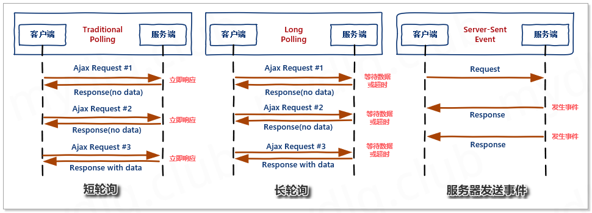
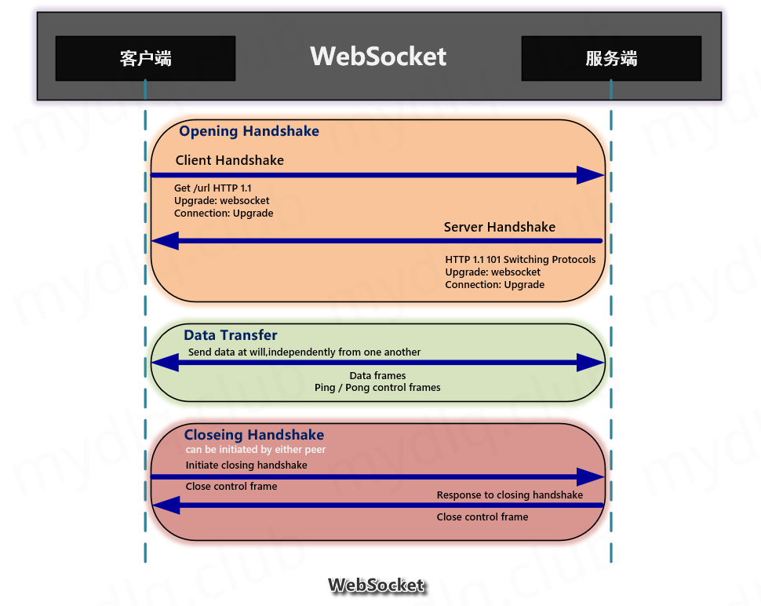

# WebSocket学习笔记

## 简介

WebSocket 是一种基于 TCP 的网络协议。在 2009 年诞生，于 2011 年被 IETF 定为标准 [RFC 6455](https://datatracker.ietf.org/doc/rfc6455/) 通信标准，并由 RFC7936 补充规范。WebSocket API 也被 W3C 定为标准。

WebSocket 也是一种 `全双工通信` 的协议，既允许客户端向服务器主动发送消息，也允许服务器主动向客户端发送消息。在 WebSocket 中，浏览器和服务器只需要完成一次握手，两者之间就可以建立持久性的连接，进行双向数据传输。

该协议的特点是：

- 连接握手阶段使用 HTTP 协议；
- 协议标识符是 ws，如果采用加密则是 wss；
- 数据格式比较轻量，性能开销小，通信高效；
- 没有同源限制，客户端可以与任意服务器通信；
- 建立在 TCP 协议之上，服务器端的实现比较容易；
- 通过 WebSocket 可以发送文本，也可以发送二进制数据；
- 与 HTTP 协议有着良好的兼容性。默认端口也是 80 和 443，并且握手阶段采用 HTTP 协议，因此握手时不容易屏蔽，能通过各种 HTTP 代理服务器；

因为是全双工通信，故经常用于实现”**聊天室**”、”**消息推送**”、”**股票信息实时动态**”等这样需求。



## 协议流程



握手之后，就可以全双工通信了，和TCP使用一致。

### 握手步骤

#### 客户端

先用带有 `Upgrade:Websocket` 请求头的 `HTTP` 请求，向服务器端发起连接请求，实现握手(`HandShake`)。客户端 `HTTP` 请求的 `Header` 头信息如下：

```http
Connection: Upgrade
Sec-WebSocket-Extensions: permessage-deflate; client_max_window_bits
Sec-WebSocket-Key: IRQYhWINfX5Fh1zdocDl6Q==
Sec-WebSocket-Version: 13
Upgrade: websocket
```

- Connection： Upgrade 表示要升级协议。
- Upgrade： Websocket 要升级协议到 websocket 协议。
- Sec-WebSocket-Extensions： 表示客户端所希望执行的扩展(如消息压缩插件)。
- Sec-WebSocket-Key： 主要用于WebSocket协议的校验，对应服务端响应头的 Sec-WebSocket-Accept。需要结合客户端的Sec-WebSocket-Key字段拼接一串固定的字符串，做一次SHA1加密得到的值。
- Sec-WebSocket-Version： 表示 websocket 的版本。如果服务端不支持该版本，需要返回一个Sec-WebSocket-Versionheader，里面包含服务端支持的版本号。


举例：

```http
GET /chat HTTP/1.1
Upgrade: websocket
Connection: Upgrade
Host: 127.0.0.1:8001
Origin: http://127.0.0.1:8001
Sec-WebSocket-Key: hj0eNqbhE/A0GkBXDRrYYw==
Sec-WebSocket-Version: 13
```


Sec-WebSocket-Key计算方法：

```python
# key：客户端传递过来的Sec-WebSocket-Key里面的值
def compute_accept_value(key):
        """Computes the value for the Sec-WebSocket-Accept header,
        given the value for Sec-WebSocket-Key.
        """
        sha1 = hashlib.sha1()
        sha1.update(utf8(key))
        sha1.update(b"258EAFA5-E914-47DA-95CA-C5AB0DC85B11")  # Magic value
        return native_str(base64.b64encode(sha1.digest()))
```


#### 服务的响应

握手成功后，由 HTTP 协议升级成 Websocket 协议，进行长连接通信，两端相互传递信息。服务端响应的 HTTP Header 头信息如下：

```http
Connection: upgrade
Sec-Websocket-Accept: TSF8/KitM+yYRbXmjclgl7DwbHk=
Upgrade: websocket
```

- Connection： Upgrade 表示要升级协议。
- Upgrade： Websocket 要升级协议到 websocket 协议。
- Sec-Websocket-Accept： 对应 Sec-WebSocket-Key 生成的值，主要是返回给客户端，让客户端对此值进行校验，证明服务端支持 WebSocket。


举例：

```http
HTTP/1.1 101 Switching Protocols 			# 必须
Content-Length: 0
Upgrade: websocket               			# 必须
Sec-Websocket-Accept: ZEs+c+VBk8Aj01+wJGN7Y15796g=  # 必须
Server: TornadoServer/4.5.1  					# 无所谓
Connection: Upgrade          					# 必须
Date: Wed, 21 Jun 2017 03:29:14 GMT  	# 无所谓
```


### 数据收发

#### 帧数据格式

WebSocket客户端与服务端通信的最小单位是帧（frame），由1个或多个帧组成一条完整的消息（message）。即：发送端将消息切割成多个帧，并发送给服务端；服务端接收消息帧，并将关联的帧重新组装成完整的消息。

```c++
 0                   1                   2                   3
 0 1 2 3 4 5 6 7 8 9 0 1 2 3 4 5 6 7 8 9 0 1 2 3 4 5 6 7 8 9 0 1
+-+-+-+-+-------+-+-------------+-------------------------------+
|F|R|R|R| opcode|M| Payload len |    Extended payload length    |
|I|S|S|S|  (4)  |A|     (7)     |             (16/64)           |
|N|V|V|V|       |S|             |   (if payload len==126/127)   |
| |1|2|3|       |K|             |                               |
+-+-+-+-+-------+-+-------------+ - - - - - - - - - - - - - - - +
|     Extended payload length continued, if payload len == 127  |
+ - - - - - - - - - - - - - - - +-------------------------------+
|                               |Masking-key, if MASK set to 1  |
+-------------------------------+-------------------------------+
| Masking-key (continued)       |          Payload Data         |
+-------------------------------- - - - - - - - - - - - - - - - +
:                     Payload Data continued ...                :
+ - - - - - - - - - - - - - - - - - - - - - - - - - - - - - - - +
|                     Payload Data continued ...                |
+---------------------------------------------------------------+
```

第一行0、1、2、3表示4个字节，第二行表示比特。

通过上图得知，一帧WebSocket数据=头 + Payload载荷，头的消息最小为2字节，最大为14字节（基本2个字节 + Extended payload length 8字节 + Masking-key 4字节 ）。

#### 数据帧格式详解

摘选自： [RFC 6455](https://datatracker.ietf.org/doc/rfc6455/)

##### FIN:  1 bit

如果是1，表示这是消息（message）的最后一个分片（fragment），如果是0，表示不是是消息（message）的最后一个分片（fragment）。

##### RSV1, RSV2, RSV3:  1 bit each

一般情况下全为0。当客户端、服务端协商采用WebSocket扩展时，这三个标志位可以非0，且值的含义由扩展进行定义。如果出现非零的值，且并没有采用WebSocket扩展，连接出错

##### Opcode:  4 bits

操作代码，Opcode的值决定了应该如何解析后续的数据载荷（data payload）。如果操作代码是不认识的，那么接收端应该断开连接（fail the connection）。

```c++
%x0：表示一个延续帧。当Opcode为0时，表示本次数据传输采用了数据分片，当前收到的数据帧为其中一个数据分片。
%x1：表示这是一个文本帧（frame）
%x2：表示这是一个二进制帧（frame）
%x3-7：保留的操作代码，用于后续定义的非控制帧。
%x8：表示连接断开。
%x9：表示这是一个ping操作。
%xA：表示这是一个pong操作。
%xB-F：保留的操作代码，用于后续定义的控制帧。
```

通常，我们可以定一个枚举来表示帧类型

```c++
enum WebSocketFrameType {
  ERROR_FRAME = 0xFF00,       // 帧错误
  INCOMPLETE_FRAME = 0xFE00,  // 不完整的帧

  OPENING_FRAME = 0x3300,     // 握手
  CLOSING_FRAME = 0x3400,

  INCOMPLETE_TEXT_FRAME = 0x01,   // 不完整的文本
  INCOMPLETE_BINARY_FRAME = 0x02, // 不完整的二进制数据

  TEXT_FRAME = 0x81,      // 文本数据
  BINARY_FRAME = 0x82,    // 二进制数据

  PING_FRAME = 0x19,  // ping
  PONG_FRAME = 0x1A   // pong
};
```


##### Mask:  1 bit

表示是否要对数据载荷进行掩码操作。**从客户端向服务端发送数据时，需要对数据进行掩码操作；从服务端向客户端发送数据时，不需要对数据进行掩码操作**。

如果服务端接收到的数据没有进行过掩码操作，服务端需要断开连接。

如果Mask是1，那么在Masking-key中会定义一个掩码键（masking key），并用这个掩码键来对数据载荷进行反掩码。**所有客户端发送到服务端的数据帧，Mask都是1**。

##### Payload length

数据载荷的长度，单位是字节。为7位，或7+16位，或1+64位。

假设数Payload length === x，如果

- x为0~126：数据的长度为x字节。
- x为126：后续2个字节代表一个16位的无符号整数，该无符号整数的值为数据的长度。
- x为127：后续8个字节代表一个64位的无符号整数（最高位为0），该无符号整数的值为数据的长度。
  此外，如果payload length占用了多个字节的话，payload length的二进制表达采用网络序（big endian，重要的位在前）。

##### Masking-key：0或4字节（32位）

所有从客户端传送到服务端的数据帧，数据载荷都进行了掩码操作，Mask为1，且携带了4字节的Masking-key。如果Mask为0，则没有Masking-key。

备注：载荷数据的长度，不包括mask key的长度。

##### Payload data：(x+y) 字节

载荷数据：包括了扩展数据、应用数据。其中，扩展数据x字节，应用数据y字节。

扩展数据：如果没有协商使用扩展的话，扩展数据数据为0字节。所有的扩展都必须声明扩展数据的长度，或者可以如何计算出扩展数据的长度。此外，扩展如何使用必须在握手阶段就协商好。如果扩展数据存在，那么载荷数据长度必须将扩展数据的长度包含在内。

应用数据：任意的应用数据，在扩展数据之后（如果存在扩展数据），占据了数据帧剩余的位置。载荷数据长度 减去 扩展数据长度，就得到应用数据的长度。

#### 掩码算法

**只有从客户端向服务端发送数据时，才需要对数据进行掩码操作；从服务端向客户端发送数据时，不需要对数据进行掩码操作。**

```c++
// unmask data
const uint8_t *c = in_buffer + pos;
for (int i = 0; i < payload_length; i++) {
  out_buffer[i] = c[i] ^ ((unsigned char *) (&mask))[i % 4];
}
```

## 代码实现

web_socket_helper.h:

```c++
/** @file ws.h
  * @brief 
  * @author teng.qing
  * @date 2021/5/21
  */

// WebSocket, v1.00 2012-09-13
//
// Description: WebSocket FRC6544 codec, written in C++.
// Homepage: http://katzarsky.github.com/WebSocket
// Author: katzarsky@gmail.com

#ifndef SAFE_EVPP_WEBSOCKET_H_
#define SAFE_EVPP_WEBSOCKET_H_

#include <assert.h>
#include <stdint.h> /* uint8_t */
#include <stdio.h> /* sscanf */
#include <ctype.h> /* isdigit */
#include <stddef.h> /* int */

// std c++
#include <vector>
#include <string>
#include <cstring>

using namespace std;

namespace evpp {
    namespace ws {

        /** @class WebSocketFrameType
          * @brief websocket帧类型
          */
        enum WebSocketFrameType {
            ERROR_FRAME = 0xFF00,       // 帧错误
            INCOMPLETE_FRAME = 0xFE00,  // 不完整的帧

            OPENING_FRAME = 0x3300,     // 握手
            CLOSING_FRAME = 0x3400,

            INCOMPLETE_TEXT_FRAME = 0x01,   // 不完整的文本
            INCOMPLETE_BINARY_FRAME = 0x02, // 不完整的二进制数据

            TEXT_FRAME = 0x81,      // 文本数据
            BINARY_FRAME = 0x82,    // 二进制数据

            PING_FRAME = 0x19,  // ping
            PONG_FRAME = 0x1A   // pong
        };

        /** @class HandshakeInfo
          * @brief 握手信息
          */
        struct HandshakeInfo {
            string resource;      // /sub
            string host;
            string origin;
            string protocol;      // Sec-WebSocket-Protocol
            string key;           // Sec-WebSocket-Key
            string version;       // Sec-WebSocket-Version
            string extensions;    // Sec-WebSocket-Extensions
        };

        /** @class ws
          * @brief
          */
        class WebSocketHelper {
        public:
            WebSocketHelper() = default;

            WebSocketHelper(const WebSocketHelper &) = delete;

            WebSocketHelper &operator=(const WebSocketHelper &) = delete;

        public:
            /**
             * @param input_frame .in. pointer to input frame
             * @param input_len .in. length of input frame
             * @return [WS_INCOMPLETE_FRAME, WS_ERROR_FRAME, WS_OPENING_FRAME]
             */

            /**@fn parseHandshake
              *@brief 获取握手信息
              *@param [in]input_frame: 缓冲区
              *@param [in]input_len: 缓冲区
              *@param [out]info: 握手信息
              *@return
              */
            WebSocketFrameType parseHandshake(const char *input_frame, int input_len, HandshakeInfo &info);

            /** @fn answerHandshake
              * @brief 获取握手响应数据
              * @param [in]info: 握手信息
              * @return 握手响应帧数据，tcp直接发送即可
              */
            string answerHandshake(const HandshakeInfo &info);

            /** @fn makeFrame
              * @brief encode
              * @param [in]msg: 裸数据
              * @param [in]msg_len: 裸数据长度
              * @param [out]buffer: 输出缓冲区
              * @param [int]buffer_len: 输出缓冲区长度
              * @return 帧长度
              */
            int makeFrame(WebSocketFrameType frame_type, const uint8_t *msg,
                          int msg_len, uint8_t *buffer, int buffer_len);

            /** @fn getFrame
              * @brief 解析客户端发来的数据，需要经过掩码处理。服务器发给客户端的不需要
              * @param [in]in_buffer: 接收缓冲区
              * @param [in]in_length: 接收缓冲区大小
              * @param [in]out_buffer: 输出缓冲区
              * @param [in]out_size: 输出缓冲区大小
              * @param [out]out_length: payload载荷数据长度
              * @param [out]use_count: 帧头数据长度+载荷数据长度，即in_buffer已使用长度
              * @return 帧类型
              */
            WebSocketFrameType getFrame(const uint8_t *in_buffer, int in_length, uint8_t *out_buffer,
                                        int out_size, int &out_length, int &use_count);

            string trim(string str);

            vector<string> explode(string theString, string theDelimiter, bool theIncludeEmptyStrings = false);
        };

    }
}

#endif //SAFE_EVPP_WEBSOCKET_H_
```

 web_socket_helper.cpp：

```c++
/** @file ws.h
  * @brief 
  * @author teng.qing
  * @date 2021/5/21
  */

#include "web_socket_helper.h"

// WebSocketHelper, v1.00 2012-09-13
//
// Description: WebSocketHelper FRC6544 codec, written in C++.
// Homepage: http://katzarsky.github.com/WebSocketHelper
// Author: katzarsky@gmail.com

#include "base64.h"
#include "evpp/sha1/sha1.h"

#include <string>
#include <vector>

using namespace std;

namespace evpp {
    namespace ws {

        WebSocketFrameType WebSocketHelper::parseHandshake(const char *input_frame, int input_len, HandshakeInfo &info) {
            // 1. copy char*/len into string
            // 2. try to parse headers until \r\n occurs
            string headers(input_frame, input_len);
            int header_end = headers.find("\r\n\r\n");

            if (header_end == string::npos) { // end-of-headers not found - do not parse
                return INCOMPLETE_FRAME;
            }

            headers.resize(header_end); // trim off any data we don't need after the headers
            int key_count = 0;
            vector<string> headers_rows = explode(headers, string("\r\n"));
            for (int i = 0; i < headers_rows.size(); i++) {
                string &header = headers_rows[i];
                if (header.find("GET") == 0) {
                    vector<string> get_tokens = explode(header, string(" "));
                    if (get_tokens.size() >= 2) {
                        info.resource = get_tokens[1];
                    }
                    key_count++;
                } else {
                    int pos = header.find(":");
                    if (pos != string::npos) {
                        string header_key(header, 0, pos);
                        string header_value(header, pos + 1);
                        header_value = trim(header_value);
                        if (header_key == "Host") info.host = header_value;
                        else if (header_key == "Origin") info.origin = header_value;
                        else if (header_key == "Sec-WebSocket-Key") info.key = header_value;
                        else if (header_key == "Sec-WebSocket-Protocol") info.protocol = header_value;
                        else if (header_key == "Sec-WebSocket-Version") info.version = header_value;
                        else if (header_key == "Sec-WebSocket-Extensions") info.extensions = header_value;
                        key_count++;
                    }
                }
            }

            if (key_count < 2) {
                return INCOMPLETE_FRAME;
            }

            //printf("HANDSHAKE-PARSED\n");
            return OPENING_FRAME;
        }

        string WebSocketHelper::trim(string str) {
            //printf("TRIM\n");
            char *whitespace = " \t\r\n";
            string::size_type pos = str.find_last_not_of(whitespace);
            if (pos != string::npos) {
                str.erase(pos + 1);
                pos = str.find_first_not_of(whitespace);
                if (pos != string::npos) str.erase(0, pos);
            } else {
                return string();
            }
            return str;
        }

        vector<string> WebSocketHelper::explode(
                string theString,
                string theDelimiter,
                bool theIncludeEmptyStrings) {
            //printf("EXPLODE\n");
            //UASSERT( theDelimiter.size(), >, 0 );

            vector<string> theStringVector;
            int start = 0, end = 0, length = 0;

            while (end != string::npos) {
                end = theString.find(theDelimiter, start);

                // If at end, use length=maxLength.  Else use length=end-start.
                length = (end == string::npos) ? string::npos : end - start;

                if (theIncludeEmptyStrings
                    || ((length > 0) /* At end, end == length == string::npos */
                        && (start < theString.size())))
                    theStringVector.push_back(theString.substr(start, length));

                // If at end, use start=maxSize.  Else use start=end+delimiter.
                start = ((end > (string::npos - theDelimiter.size()))
                         ? string::npos : end + theDelimiter.size());
            }
            return theStringVector;
        }

        string WebSocketHelper::answerHandshake(const HandshakeInfo &info) {
            unsigned char digest[20]; // 160 bit sha1 digest

            string answer;
            answer += "HTTP/1.1 101 Switching Protocols\r\n";
            answer += "Upgrade: WebSocket\r\n";
            answer += "Connection: Upgrade\r\n";

            assert(!info.key.empty());
            if (!info.key.empty()) {
                string accept_key;
                accept_key += info.key;
                accept_key += "258EAFA5-E914-47DA-95CA-C5AB0DC85B11"; //RFC6544_MAGIC_KEY

                //printf("INTERMEDIATE_KEY:(%s)\n", accept_key.data());

                SHA1 sha;
                sha.Input(accept_key.data(), accept_key.size());
                sha.Result((unsigned *) digest);

                //printf("DIGEST:"); for(int i=0; i<20; i++) printf("%02x ",digest[i]); printf("\n");

                //little endian to big endian
                for (int i = 0; i < 20; i += 4) {
                    unsigned char c;

                    c = digest[i];
                    digest[i] = digest[i + 3];
                    digest[i + 3] = c;

                    c = digest[i + 1];
                    digest[i + 1] = digest[i + 2];
                    digest[i + 2] = c;
                }

                //printf("DIGEST:"); for(int i=0; i<20; i++) printf("%02x ",digest[i]); printf("\n");

                accept_key = base64_encode2((const unsigned char *) digest, 20); //160bit = 20 bytes/chars

                answer += "Sec-WebSocket-Accept: " + (accept_key) + "\r\n";
            }
            if (info.protocol.length() > 0) {
                answer += "Sec-WebSocket-Protocol: " + (info.protocol) + "\r\n";
            }
            answer += "\r\n";
            return answer;

            //return WS_OPENING_FRAME;
        }

        int WebSocketHelper::makeFrame(WebSocketFrameType frame_type, const uint8_t *msg,
                                       int msg_len, uint8_t *buffer, int buffer_len) {
            int pos = 0;
            int size = msg_len;
            buffer[pos++] = (unsigned char) frame_type; // text frame

            if (size <= 125) {
                buffer[pos++] = size;
            } else if (size <= 65535) {
                buffer[pos++] = 126; //16 bit length follows

                buffer[pos++] = (size >> 8) & 0xFF; // leftmost first
                buffer[pos++] = size & 0xFF;
            } else { // >2^16-1 (65535)
                buffer[pos++] = 127; //64 bit length follows

                // write 8 bytes length (significant first)

                // since msg_length is int it can be no longer than 4 bytes = 2^32-1
                // padd zeroes for the first 4 bytes
                for (int i = 3; i >= 0; i--) {
                    buffer[pos++] = 0;
                }
                // write the actual 32bit msg_length in the next 4 bytes
                for (int i = 3; i >= 0; i--) {
                    buffer[pos++] = ((size >> 8 * i) & 0xFF);
                }
            }
            memcpy((void *) (buffer + pos), msg, size);
            return (size + pos);
        }

        WebSocketFrameType WebSocketHelper::getFrame(const uint8_t *in_buffer, int in_length, uint8_t *out_buffer,
                                                     int out_size, int &out_length, int &use_count) {
            /* ws frame: RFC6455
              0                   1                   2                   3
              0 1 2 3 4 5 6 7 8 9 0 1 2 3 4 5 6 7 8 9 0 1 2 3 4 5 6 7 8 9 0 1
             +-+-+-+-+-------+-+-------------+-------------------------------+
             |F|R|R|R| opcode|M| Payload len |    Extended payload length    |
             |I|S|S|S|  (4)  |A|     (7)     |             (16/64)           |
             |N|V|V|V|       |S|             |   (if payload len==126/127)   |
             | |1|2|3|       |K|             |                               |
             +-+-+-+-+-------+-+-------------+ - - - - - - - - - - - - - - - +
             |     Extended payload length continued, if payload len == 127  |
             + - - - - - - - - - - - - - - - +-------------------------------+
             |                               |Masking-key, if MASK set to 1  |
             +-------------------------------+-------------------------------+
             | Masking-key (continued)       |          Payload Data         |
             +-------------------------------- - - - - - - - - - - - - - - - +
             :                     Payload Data continued ...                :
             + - - - - - - - - - - - - - - - - - - - - - - - - - - - - - - - +
             |                     Payload Data continued ...                |
             +---------------------------------------------------------------+
            * see:
            *     RFC6455: https://datatracker.ietf.org/doc/html/rfc6455)
            *     websocket报文格式及掩码处理方式: https://www.cnblogs.com/laohaozi/p/12537571.html
            */

            if (in_length < 3) return INCOMPLETE_FRAME;

            unsigned char msg_opcode = in_buffer[0] & 0x0F;
            unsigned char msg_fin = (in_buffer[0] >> 7) & 0x01;   // final frame
            unsigned char msg_masked = (in_buffer[1] >> 7) & 0x01;

            // *** message decoding

            int payload_length = 0;
            int pos = 2;
            int length_field = in_buffer[1] & (~0x80);
            unsigned int mask = 0;

            //printf("IN:"); for(int i=0; i<20; i++) printf("%02x ",buffer[i]); printf("\n");

            if (length_field <= 125) {
                payload_length = length_field;
            } else if (length_field == 126) { //msglen is 16bit!
                //payload_length = in_buffer[2] + (in_buffer[3]<<8);
                //payload_length = in_buffer[3] + (in_buffer[2]<<8);
                payload_length = in_buffer[2];
                for (int i = 0; i < 1; i++) {
                    payload_length = (payload_length << 8) + in_buffer[3 + i];
                }
                pos += 2;
            } else if (length_field == 127) { //msglen is 64bit!

                payload_length = in_buffer[2];
                for (int i = 0; i < 4; i++) {
                    payload_length = (payload_length << 8) + in_buffer[3 + i];
                }

                //payload_length = in_buffer[2] + (in_buffer[3]<<8);
                pos += 8;
            }

            //printf("PAYLOAD_LEN: %08x\n", payload_length);
            if (in_length < payload_length + pos) {
                printf("%s\n", "return INCOMPLETE_FRAME");
                return INCOMPLETE_FRAME;
            }

            if (msg_masked) {
                mask = *((unsigned int *) (in_buffer + pos));
                //printf("MASK: %08x\n", mask);
                pos += 4;

                // unmask data
                const uint8_t *c = in_buffer + pos;
                for (int i = 0; i < payload_length; i++) {
                    // mod_by xmcy0011@sina.com 2021-05-23 backup code
                    // c[i] = c[i] ^ ((unsigned char *) (&mask))[i % 4];
                    out_buffer[i] = c[i] ^ ((unsigned char *) (&mask))[i % 4];
                }
            }

            use_count = payload_length + pos;
            out_length = payload_length;
            if (payload_length > out_size || use_count > in_length) {
                //TODO: if output buffer is too small -- ERROR or resize(free and allocate bigger one) the buffer ?
                return ERROR_FRAME;
            }

            // del_by xmcy0011@sina.com 2021-05-23 unmask data use output buffer,do not need copy
            //memcpy((void *) out_buffer, (void *) (in_buffer + pos), payload_length);

            //out_buffer[payload_length] = 0;
            //printf("TEXT: %s\n", out_buffer);

            if (msg_opcode == 0x0) return (msg_fin) ? TEXT_FRAME : INCOMPLETE_TEXT_FRAME; // continuation frame
            if (msg_opcode == 0x1) return (msg_fin) ? TEXT_FRAME : INCOMPLETE_TEXT_FRAME;
            if (msg_opcode == 0x2) return (msg_fin) ? BINARY_FRAME : INCOMPLETE_BINARY_FRAME;
            if (msg_opcode == 0x9) return PING_FRAME; // 9 ping
            if (msg_opcode == 0xA) return PONG_FRAME; // 10 pong

            return ERROR_FRAME;
        }

    }
}
```

完整代码：[evpp修改版：增加openssl和websocket支持](https://github.com/xmcy0011/evpp/blob/master/evpp/ws/web_socket_helper.cc)


## 参考

- [apache 配置 wss websocket打开握手超时](https://blog.csdn.net/weixin_39785814/article/details/112086893)
- [WebSocket协议入门介绍](https://www.cnblogs.com/nuccch/p/10947256.html)
- [刨根问底HTTP和WebSocket协议(二）](https://www.jianshu.com/p/f666da1b1835)
- [websocket报文格式及掩码处理方式](https://www.cnblogs.com/laohaozi/p/12537571.html)
- [RFC 6455](https://datatracker.ietf.org/doc/rfc6455/)

