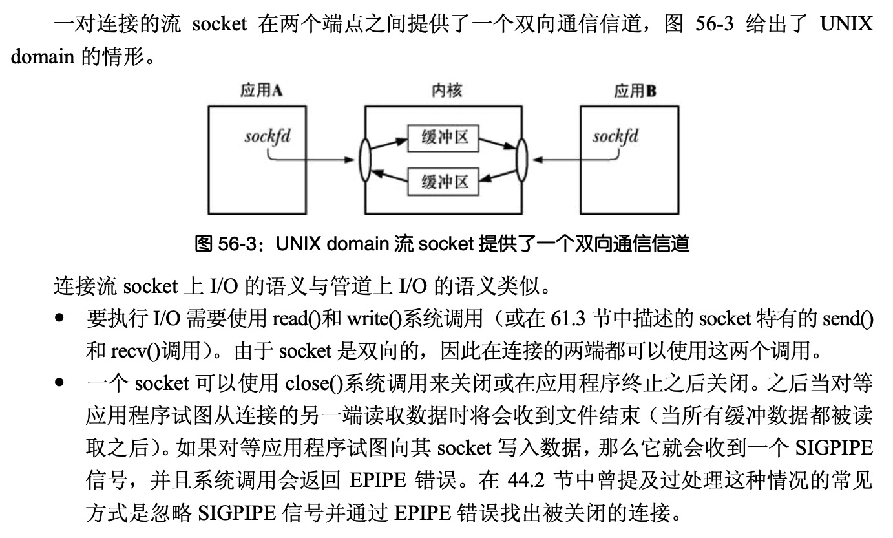
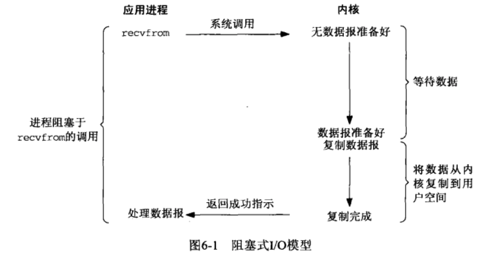
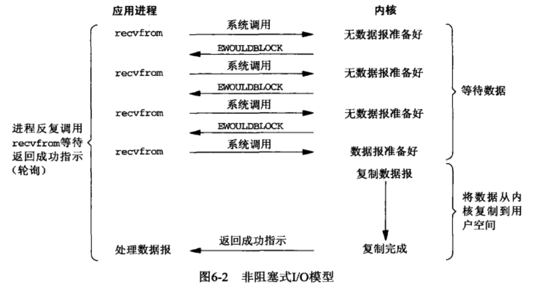
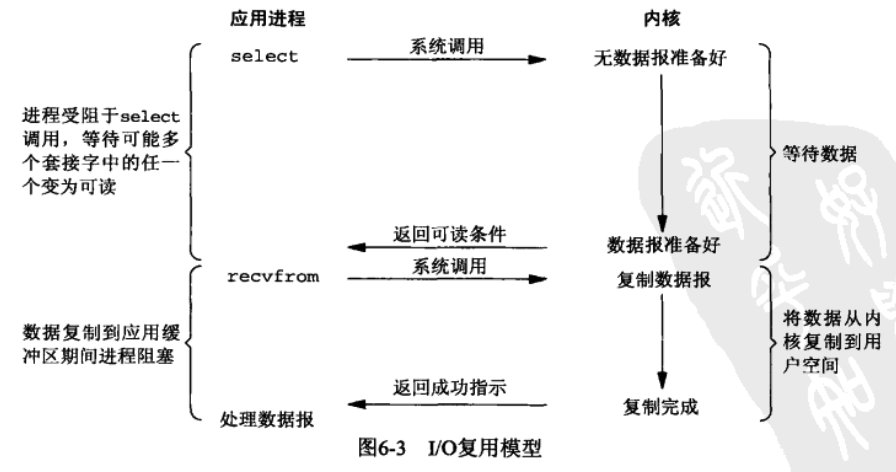
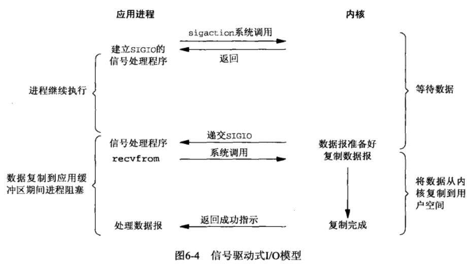
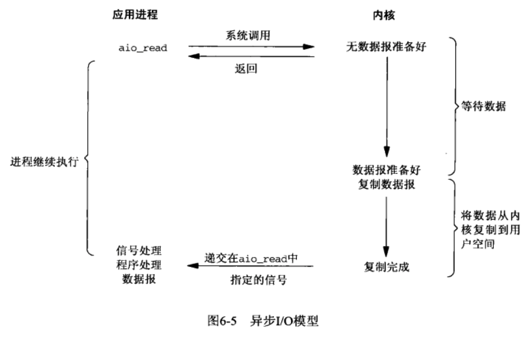
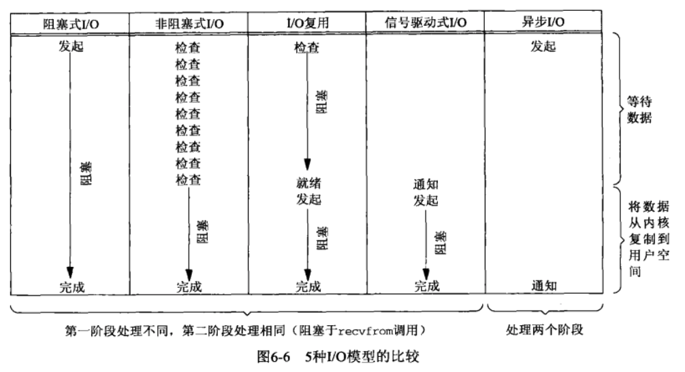

<!-- TOC -->

- [如何管理大量TCP连接](#如何管理大量tcp连接)
    - [C10K、C10M问题](#c10kc10m问题)
    - [高性能IO](#高性能io)
        - [关于I/O](#关于io)
        - [关于I/O模型](#关于io模型)
            - [阻塞式I/O](#阻塞式io)
            - [非阻塞式I/O](#非阻塞式io)
            - [I/O复用模型](#io复用模型)
            - [信号驱动式I/O（不常用）](#信号驱动式io不常用)
            - [异步I/O模型（不常用）](#异步io模型不常用)
            - [5种模型对比](#5种模型对比)
        - [关于I/O复用函数](#关于io复用函数)
            - [select](#select)
            - [poll](#poll)
            - [epoll](#epoll)
        - [2种设计模式](#2种设计模式)
            - [reactor(unix)](#reactorunix)
            - [preactor(windows)](#preactorwindows)
        - [关于共享内存](#关于共享内存)
        - [关于用户态TCP](#关于用户态tcp)
    - [windows iocp](#windows-iocp)
    - [连接"桶"](#连接桶)
    - [分布式集群](#分布式集群)

<!-- /TOC -->

# 如何管理大量TCP连接

## C10K、C10M问题
## 高性能IO

$ wget https://src.fedoraproject.org/repo/pkgs/man-pages-zh-CN/manpages-zh-1.5.1.tar.gz/13275fd039de8788b15151c896150bc4/manpages-zh-1.5.1.tar.gz    # 下载
$ tar zxf manpages-zh-1.5.1.tar.gz -C /usr/src
$ cd /usr/src/manpages-zh-1.5.1/
$ ./configure --disable-zhtw  --prefix=/usr/local/zhman && make && make install
$ echo "alias cman='man -M /usr/local/zhman/share/man/zh_CN' " >>.bash_profile
$ source .bash_profile 
$ cman ls                   # 中文版使用cman，测试一下

### 关于I/O

首先什么是I/O？

I/O(input/output)，即输入输出设备，现实中键盘和鼠标是输入设备，显示器是输出设备，在《深入理解计算机系统》第一章1.7.4节中，有说到：**文件是对I/O设备的抽象表示，文件就是字节序列，仅此而已。每个I/O设备，包括磁盘、键盘、显示器，甚至网络，都可以看出是文件**。

所以，不难理解在Linux的API中，为什么发送TCP数据包可以调用write()，接收数据包可以调用read()了，在《Linux-UNIX系统编程手册》中第56.5.4节流socket I/O中有描述：



代码大概是这样：

```c++
while(true){
	// ...
	// 调用read等待网络数据的到来，期间一直阻塞
	size_t len = read(socket_fd, buffer, kMaxBufferLen);
	// 调用write把要发送的数据写入到socket缓冲区，等待发送
	write(socket_fd, buffer, len);
	// ...
}
```


既然网络也被抽象为文件，那么如何使读写（收发）比较快，拥有很高的性能就很关键了，《UNIX网络编程卷1》第6.2节 I/O模型里面介绍了5种模型，我们来一起看看。

### 关于I/O模型

- 阻塞式I/O
- 非阻塞式I/O
- I/O复用（select和poll）
- 信号驱动式I/O（SIGIO）
- 异步I/O（POSIX的aio_系列函数）

后面2种不常用，主要看前3种即可。


#### 阻塞式I/O



TODO...


#### 非阻塞式I/O



TODO...


#### I/O复用模型



TODO...


#### 信号驱动式I/O（不常用）



TODO...


#### 异步I/O模型（不常用）



TODO...


#### 5种模型对比



TODO...


### 关于I/O复用函数

其实最重要的就是这一节吧，实现大量TCP的连接的答案就是epoll技术，但是并不是每种场合下epoll都适用：

- 比如epoll是linux特有的，windows有iocp（完成端口）的技术，所以如果是windows服务器，就不适合
- epoll适合连接数多，但是都不活跃的场景，比如IM（用户虽然在线，但并不是时时刻刻都在发消息）、消息推送等。select/poll适合对吞吐量要求高，连接数少（千级别）的场景，比如音视频传输（每一秒都在传输大量的数据）、文件传输等，当然对于这些对速度有要求的实时传输业务，可能更好的选择是UDP协议。


TODO...


#### select

#### poll

#### epoll


### 2种设计模式

#### reactor(unix)
#### preactor(windows)

### 关于共享内存

### 关于用户态TCP

## windows iocp
## 连接"桶"
## 分布式集群