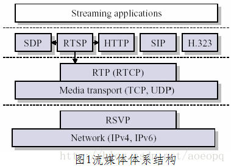
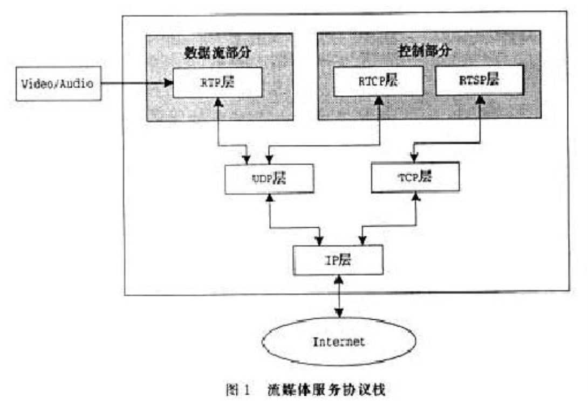
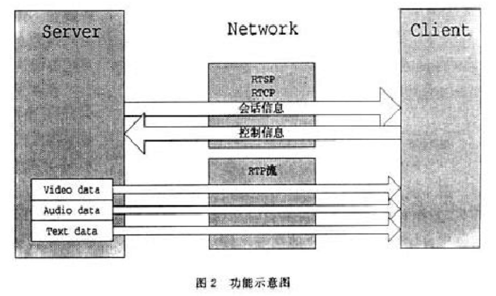

## protocol

### introduce

- Rtsp协议一般与RTP/RTCP协议混合使用；
- Rtsp / Http 协议是共有协议，有专门组织维护，Rtmp协议是私有协议；
- RTMP和HTTP有adaptive streaming的技术，RTSP没有;
- RTSP实时性是最好的，HTTP实时性比较差；
- ios不支持rtsp，安卓支持；

### 直播

#### RTP/RTCP

#### RTMP

#### HLS

### 点播

#### HTTP

### 安防

#### RTSP

#### GB/T 28181

#### SIP/SDP

#### ONVIF

## media server

### live555

### easydarwin

### red5

### nginx-rtmp

### WebRTC
#### NetEQ

## 参考

- [流媒体协议简介（整理 & 总结）](https://www.cnblogs.com/absdata/p/10488266.html)
- [网易视频云：流媒体服务器原理和架构解析](https://wenku.baidu.com/view/bbf0baee915f804d2b16c1fc.html)